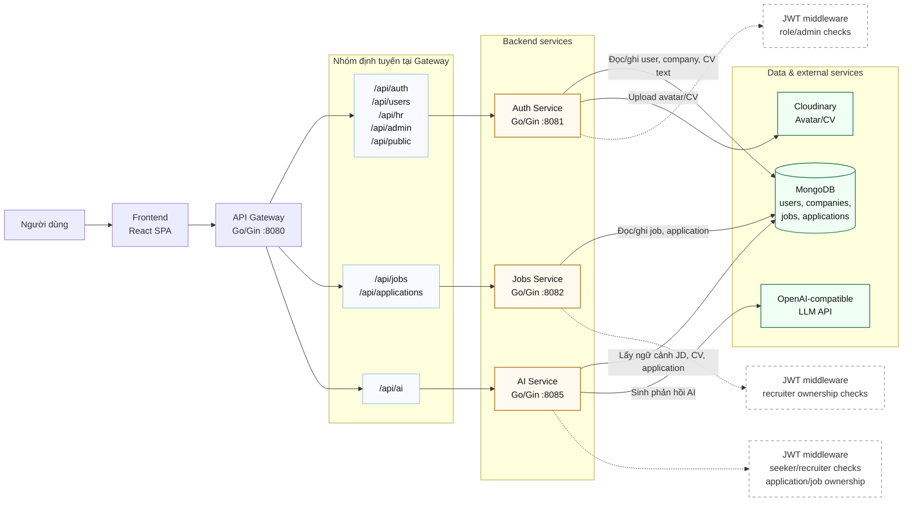

### Sơ đồ kiến trúc Microservices

Sơ đồ này minh họa kiến trúc hiện thực của hệ thống JobBridge AI. Hệ thống được tổ chức theo mô hình microservices, trong đó frontend React SPA gửi toàn bộ request nghiệp vụ đến API Gateway. Gateway đóng vai trò reverse proxy và định tuyến request theo path đến các service backend tương ứng, bao gồm Auth Service, Jobs Service và AI Service.

API Gateway không trực tiếp xác thực JWT hoặc quyết định quyền truy cập nghiệp vụ. Trách nhiệm xác thực và phân quyền được thực hiện tại từng service bằng middleware và logic handler. Cách tổ chức này giúp từng service tự bảo vệ tài nguyên của mình, đồng thời tránh phụ thuộc hoàn toàn vào một lớp gateway duy nhất.

Các thành phần chính của kiến trúc gồm:

1. **Frontend (React SPA):** Giao diện người dùng cho khách truy cập, ứng viên, nhà tuyển dụng và quản trị viên. Frontend gọi API qua Gateway bằng REST/HTTP.
2. **API Gateway (Go/Gin, port 8080):** Điểm vào API duy nhất cho frontend. Gateway định tuyến các nhóm path như `/api/auth`, `/api/users`, `/api/hr`, `/api/admin`, `/api/public` sang Auth Service; `/api/jobs`, `/api/applications` sang Jobs Service; và `/api/ai` sang AI Service.
3. **Auth Service (Go/Gin, port 8081):** Quản lý đăng ký, đăng nhập, JWT, hồ sơ người dùng, công ty, quản trị viên, upload avatar/CV lên Cloudinary và trích xuất text từ CV PDF để lưu vào MongoDB.
4. **Jobs Service (Go/Gin, port 8082):** Quản lý tin tuyển dụng, tìm kiếm job, tin tuyển dụng của recruiter và hồ sơ ứng tuyển. Service này kiểm tra JWT và role recruiter ở các API cần bảo vệ.
5. **AI Service (Go/Gin, port 8085):** Cung cấp AI Interview Coach, AI Interview Quiz và HR Evaluate CV. Service này kiểm tra JWT, role và quyền sở hữu tài nguyên trước khi gọi OpenAI-compatible API.
6. **MongoDB:** Cơ sở dữ liệu chính của hệ thống, lưu các collection `users`, `companies`, `jobs` và `applications`.
7. **Cloudinary:** Lưu trữ file avatar và CV. URL file được lưu trong MongoDB.
8. **OpenAI-compatible API:** Nhà cung cấp mô hình ngôn ngữ lớn cho các chức năng AI.

Luồng xử lý tổng quát: người dùng thao tác trên frontend, frontend gửi REST request đến API Gateway, Gateway định tuyến request đến service phù hợp, service tự xác thực/phân quyền nếu endpoint yêu cầu đăng nhập, sau đó đọc/ghi MongoDB hoặc gọi dịch vụ ngoài như Cloudinary/OpenAI nếu cần. Kết quả được trả ngược về frontend thông qua Gateway.

