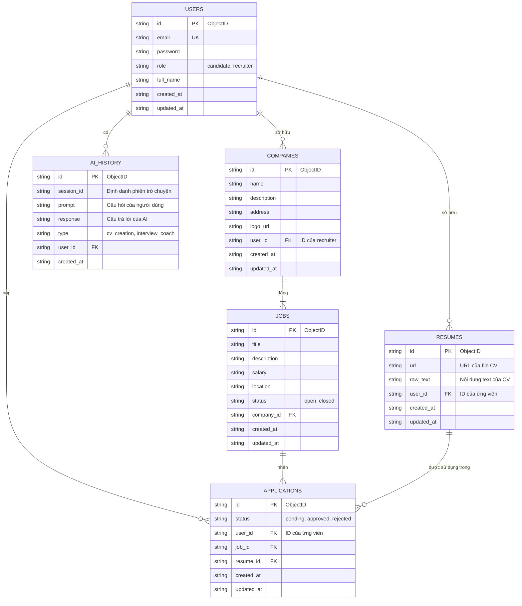

**Ghi chú để vẽ (Quan trọng):**

*   **Về PK/FK trong NoSQL:** Sơ đồ này sử dụng ký hiệu `PK` (Khóa chính) và `FK` (Khóa ngoại) để **mô hình hóa các mối quan hệ logic** giữa các collection trong MongoDB. Trong thực tế, MongoDB không thực thi các ràng buộc khóa ngoại như CSDL quan hệ. Thay vào đó:
    *   `PK` đại diện cho trường `_id` (ObjectID) duy nhất của mỗi document.
    *   `FK` đại diện cho một trường lưu trữ `_id` của một document khác để tạo tham chiếu (reference). Việc "join" dữ liệu sẽ được xử lý ở tầng ứng dụng (ví dụ: dùng `$lookup` hoặc query 2 lần).

*   **Thực thể (Collection):**
    *   `USERS`: Lưu thông tin người dùng (cả ứng viên và nhà tuyển dụng).
    *   `COMPANIES`: Lưu thông tin công ty, liên kết với một `user` có vai trò là `recruiter`.
    *   `JOBS`: Lưu thông tin các tin tuyển dụng, thuộc về một `company`.
    *   `RESUMES`: Lưu thông tin các CV mà ứng viên tải lên.
    *   `APPLICATIONS`: Bảng trung gian, ghi lại việc một `user` (ứng viên) đã nộp `resume` nào cho `job` nào.
    *   `AI_HISTORY`: Lưu lại lịch sử các cuộc hội thoại giữa người dùng và AI.
*   **Mối quan hệ (Quan hệ logic):**
    *   `one-to-many` (một-nhiều): Ví dụ, một `COMPANIES` có thể có nhiều `JOBS`. Ký hiệu là `||--|{`.
    *   `one-to-one` (một-một): Ví dụ, một `USERS` (recruiter) chỉ quản lý một `COMPANIES`. Ký hiệu là `||--o{`.
*   **Khóa (Định danh logic):**
    *   `PK`: Khóa chính (Primary Key) - Tương đương `_id`.
    *   `FK`: Khóa ngoại (Foreign Key) - Tương đương trường tham chiếu.
    *   `UK`: Khóa duy nhất (Unique Key) - Ràng buộc duy nhất ở cấp độ ứng dụng hoặc index.
