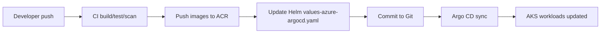

# JobBridge AI - Architecture & Infrastructure

Tài liệu này mô tả đầy đủ kiến trúc, hạ tầng, định danh/role, và quy trình triển khai dự án JobBridge AI dựa trên cấu hình hiện có trong repo.

## 1) Tổng quan hệ thống
JobBridge AI là nền tảng tuyển dụng theo kiến trúc microservices, gồm 5 dịch vụ chính chạy trên Kubernetes:
- Frontend (React/Vite)
- API Gateway (Go)
- Auth Service (Go)
- Jobs Service (Go)
- AI Service (Go)

Các service backend giao tiếp nội bộ trong cluster; gateway làm entrypoint API cho frontend.

Tham chiếu:
- [docker-compose.yml](docker-compose.yml) (mô tả local stack)
- [backend/README.md](backend/README.md) (port, env, API chính)
- [deploy/helm/jobbridge/templates/app-workloads.yaml](deploy/helm/jobbridge/templates/app-workloads.yaml) (Deployment/Service)

## 2) Các dịch vụ và cổng (ports)
**Backend (Go, REST):**
- Gateway: 8080 (entrypoint API)
- Auth: 8081
- Jobs: 8082
- AI: 8085

**Frontend:**
- Nginx/Static: 80 (container)

**Database:**
- MongoDB: 27017 (trong cluster), 27018 (local Docker/Podman)

Nguồn:
- [backend/README.md](backend/README.md)
- [deploy/helm/jobbridge/values.yaml](deploy/helm/jobbridge/values.yaml)
- [docker-compose.yml](docker-compose.yml)

## 3) Hạ tầng Azure (IaC: Terraform)
Dự án dùng Terraform chia 3 lớp để dựng hạ tầng trên Azure:

### Layer 01 - Foundation
Tạo Resource Group + Azure Container Registry (ACR).
- RG: mặc định `rg-jobbridge`
- ACR: mặc định `acrjobbridge` (SKU Basic)

Nguồn:
- [deploy/terraforms/layers/01-foundation/main.tf](deploy/terraforms/layers/01-foundation/main.tf)
- [deploy/terraforms/layers/01-foundation/variables.tf](deploy/terraforms/layers/01-foundation/variables.tf)

### Layer 02 - Cluster
Tạo AKS cluster + cấu hình node pool + bật CSI Key Vault Secrets Provider.
- AKS: mặc định `aks-jobbridge`
- Network plugin: `kubenet`
- Node pool: cấu hình tối ưu chi phí (1 node)
- Tích hợp ACR: AKS kubelet được gán role `AcrPull`

Nguồn:
- [deploy/terraforms/layers/02-cluster/main.tf](deploy/terraforms/layers/02-cluster/main.tf)
- [deploy/terraforms/modules/aks/main.tf](deploy/terraforms/modules/aks/main.tf)

### Layer 03 - Security
Tạo Key Vault, nạp secrets, và cấp quyền cho AKS CSI identity.
- Key Vault: mặc định `kv-jobbridge`
- Secrets: JWT, OpenAI, Cloudinary

Nguồn:
- [deploy/terraforms/layers/03-security/main.tf](deploy/terraforms/layers/03-security/main.tf)
- [deploy/terraforms/modules/keyvault/main.tf](deploy/terraforms/modules/keyvault/main.tf)

### Terraform state backend
Dùng Azure Storage Account để lưu trạng thái Terraform.
Nguồn:
- [deploy/scripts/setup-tfstate-backend.sh](deploy/scripts/setup-tfstate-backend.sh)
- [deploy/terraforms/layers/01-foundation/backend.tf](deploy/terraforms/layers/01-foundation/backend.tf)

## 4) Danh tính (Identity) & Role/Access
### 4.1 AKS Identity
AKS dùng **System Assigned Managed Identity**. Ngoài ra, khi bật Key Vault Secrets Provider, Azure tự tạo một identity cho CSI.

### 4.2 ACR Pull Role
AKS kubelet identity được gán role `AcrPull` trên ACR để pull image:
- `azurerm_role_assignment` với `role_definition_name = "AcrPull"`

Nguồn:
- [deploy/terraforms/modules/aks/main.tf](deploy/terraforms/modules/aks/main.tf)

### 4.3 Key Vault Access Policy
Key Vault cấp policy cho:
- Deployer (người/Service Principal chạy Terraform): `Get`, `List`, `Set`, `Delete`, `Purge`, `Recover`
- AKS CSI identity: `Get`, `List`

Nguồn:
- [deploy/terraforms/modules/keyvault/main.tf](deploy/terraforms/modules/keyvault/main.tf)

### 4.4 GitHub Actions Identity
Các workflow CI/CD hỗ trợ 2 cách đăng nhập Azure:
- Service Principal secret (`AZURE_CREDENTIALS`)
- OIDC với `AZURE_CLIENT_ID`, `AZURE_TENANT_ID`, `AZURE_SUBSCRIPTION_ID`

Nguồn:
- [github/workflows/ci-build-scan-push.yml](.github/workflows/ci-build-scan-push.yml)
- [github/workflows/azure-terraform-layers.yml](.github/workflows/azure-terraform-layers.yml)
- [github/workflows/bootstrap-argocd.yml](.github/workflows/bootstrap-argocd.yml)

## 5) Kubernetes lớp ứng dụng (Helm)
Helm chart quản lý toàn bộ K8s resources:
- Deployment + Service cho từng service (frontend, gateway, auth, jobs, ai)
- MongoDB StatefulSet + Service
- Ingress
- HPA
- PDB
- Secret + SecretProviderClass (Key Vault CSI)
- ClusterIssuer (cert-manager)

Lưu ý namespace:
- Chart không set `namespace`, nên sẽ deploy vào namespace do Helm/Argo CD chỉ định.
- Thực tế thường dùng namespace `jobbridge` cho app và `argocd` cho Argo CD.

Nguồn:
- [deploy/helm/jobbridge/templates/app-workloads.yaml](deploy/helm/jobbridge/templates/app-workloads.yaml)
- [deploy/helm/jobbridge/templates/mongodb-statefulset.yaml](deploy/helm/jobbridge/templates/mongodb-statefulset.yaml)
- [deploy/helm/jobbridge/templates/ingress.yaml](deploy/helm/jobbridge/templates/ingress.yaml)
- [deploy/helm/jobbridge/templates/hpa.yaml](deploy/helm/jobbridge/templates/hpa.yaml)
- [deploy/helm/jobbridge/templates/pdb.yaml](deploy/helm/jobbridge/templates/pdb.yaml)
- [deploy/helm/jobbridge/templates/secret.yaml](deploy/helm/jobbridge/templates/secret.yaml)
- [deploy/helm/jobbridge/templates/secret-provider-class.yaml](deploy/helm/jobbridge/templates/secret-provider-class.yaml)
- [deploy/helm/jobbridge/templates/clusterissuer.yaml](deploy/helm/jobbridge/templates/clusterissuer.yaml)

## 6) Secrets & cấu hình ứng dụng
Có 2 chế độ cấp secrets:

### 6.1 Key Vault (production)
- Bật `keyvault.enabled: true`
- CSI driver mount secrets từ Key Vault vào pod, tạo Secret Kubernetes `*-secret`

Nguồn:
- [deploy/helm/jobbridge/values-azure-argocd.yaml](deploy/helm/jobbridge/values-azure-argocd.yaml)
- [deploy/helm/jobbridge/templates/secret-provider-class.yaml](deploy/helm/jobbridge/templates/secret-provider-class.yaml)

### 6.2 Fallback secret (local/dev)
- `keyvault.enabled: false` → Helm tạo Secret trực tiếp từ `secretsFallback`

Nguồn:
- [deploy/helm/jobbridge/values.yaml](deploy/helm/jobbridge/values.yaml)
- [deploy/helm/jobbridge/templates/secret.yaml](deploy/helm/jobbridge/templates/secret.yaml)

Các biến chính:
- `JWT_SECRET`, `JWT_ISSUER`, `ACCESS_TOKEN_TTL_MINUTES`
- `OPENAI_API_KEY`, `MODEL`, `URL_BASE`
- `CLOUDINARY_URL`, `CLOUDINARY_FOLDER`

Nguồn:
- [backend/README.md](backend/README.md)

## 7) Networking, DNS, TLS
Ingress NGINX được dùng để expose frontend và gateway:
- `jobbridge.duckdns.org` → frontend + gateway
- Local: `jobbridge.local` và `api.jobbridge.local`

TLS:
- cert-manager tạo ClusterIssuer `letsencrypt-prod`
- TLS secret: `jobbridge-tls-secret`

Nguồn:
- [deploy/helm/jobbridge/values-azure.yaml](deploy/helm/jobbridge/values-azure.yaml)
- [deploy/argocd/README.md](deploy/argocd/README.md)

## 8) CI/CD và GitOps
**CI:** build/test/scan + build image + push ACR.
- Workflow: [github/workflows/ci-build-scan-push.yml](.github/workflows/ci-build-scan-push.yml)
- Build bằng Kaniko
- Scan image với Trivy
- Tag image theo SHA

**CD/GitOps:**
- Workflow cập nhật tag image vào Helm values (ArgoCD):
  - [github/workflows/deploy-aks.yml](.github/workflows/deploy-aks.yml)
- ArgoCD theo dõi repo, auto-sync Helm release lên AKS.

Nguồn:
- [deploy/argocd/README.md](deploy/argocd/README.md)

## 8.1) Argo CD (GitOps controller)
Argo CD là công cụ GitOps chạy trong cluster, theo dõi repo và đồng bộ K8s resources theo Helm chart.

Bootstrap Argo CD bao gồm:
- Cài `cert-manager` (để cấp TLS cho ingress).
- Cài Argo CD core vào namespace `argocd`.
- Tạo ingress cho UI Argo CD.
- Tạo Argo CD Application cho JobBridge.
- Patch lại repo URL/branch để Argo CD theo dõi.

Nguồn:
- [deploy/scripts/bootstrap-argocd.sh](deploy/scripts/bootstrap-argocd.sh)
- [github/workflows/bootstrap-argocd.yml](.github/workflows/bootstrap-argocd.yml)

GitOps flow (tóm tắt):

## 9) Monitoring
Stack monitoring dùng kube-prometheus-stack + Grafana:
- Namespace: `monitoring`
- Grafana ingress: `grafana.jobbridge.duckdns.org`

Nguồn:
- [deploy/monitoring/README.md](deploy/monitoring/README.md)
- [deploy/scripts/install-monitoring.sh](deploy/scripts/install-monitoring.sh)

## 10) Local development
**Docker Compose:**
- MongoDB + 4 backend services
- Ports: 8080/8081/8082/8085, Mongo 27018

Nguồn:
- [docker-compose.yml](docker-compose.yml)

**Tilt (live-reload):**
- Orchestrate backend + frontend + MongoDB

Nguồn:
- [Tiltfile](Tiltfile)

## 11) Quy trình triển khai (end-to-end)
### 11.1 Bootstrap Terraform state
Chạy script để tạo Storage Account cho Terraform state:
- [deploy/scripts/setup-tfstate-backend.sh](deploy/scripts/setup-tfstate-backend.sh)

### 11.2 Deploy hạ tầng (Terraform)
- Chạy `deploy/scripts/deploy-infra.sh` để apply 3 layers liên tục
- Hoặc dùng workflow [github/workflows/azure-terraform-layers.yml](.github/workflows/azure-terraform-layers.yml)

### 11.3 Tạo secrets lên Key Vault
- Dùng script `deploy/scripts/setup-azure.sh` (đọc từ file `.env`)
- Lưu ý: cần quyền `Key Vault Secrets Officer`

Nguồn:
- [deploy/scripts/setup-azure.sh](deploy/scripts/setup-azure.sh)

### 11.4 Bootstrap ArgoCD
- Chạy [deploy/scripts/bootstrap-argocd.sh](deploy/scripts/bootstrap-argocd.sh)
- Hoặc workflow [github/workflows/bootstrap-argocd.yml](.github/workflows/bootstrap-argocd.yml)

### 11.5 Deploy ứng dụng
- CI build/push image lên ACR
- CD update [deploy/helm/jobbridge/values-azure-argocd.yaml](deploy/helm/jobbridge/values-azure-argocd.yaml)
- ArgoCD auto-sync lên AKS

## 12) Sơ đồ phụ thuộc (logic)
- Frontend → API Gateway
- Gateway → Auth/Jobs/AI
- Auth/Jobs/AI → MongoDB
- AI → OpenAI API
- Auth → Cloudinary (upload avatar/CV)

Nguồn:
- [backend/README.md](backend/README.md)
- [deploy/helm/jobbridge/values.yaml](deploy/helm/jobbridge/values.yaml)

---

Nếu bạn muốn mình bổ sung sơ đồ kiến trúc dạng hình (Mermaid) hoặc map cụ thể các namespace/pod/service với tên release, nói mình biết thông số môi trường (dev/prod) đang dùng nhé.