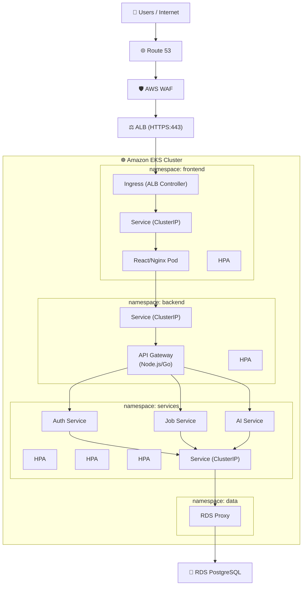
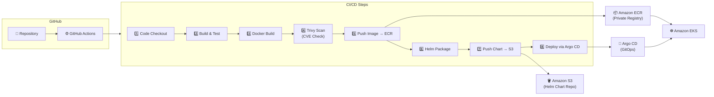
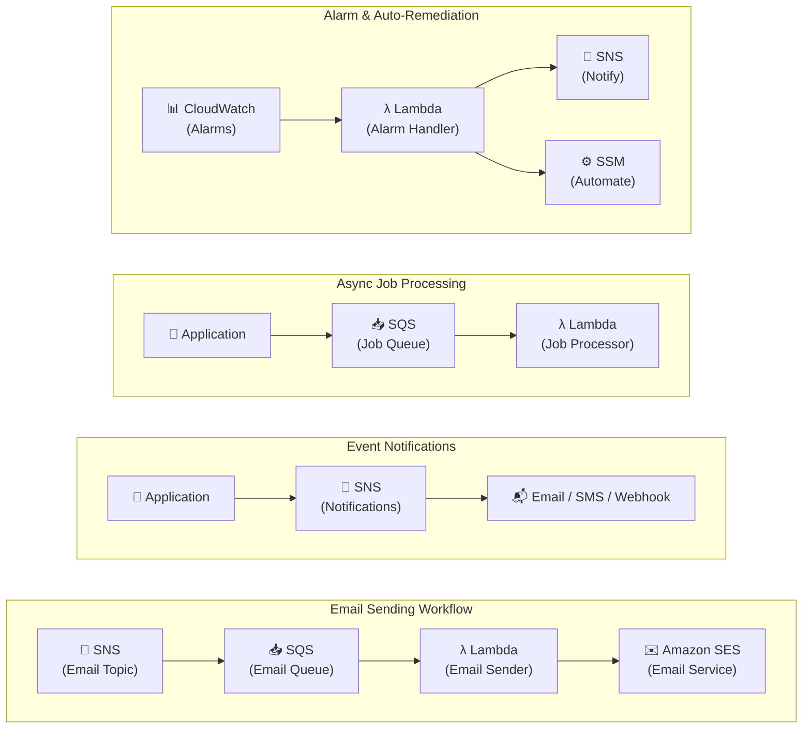
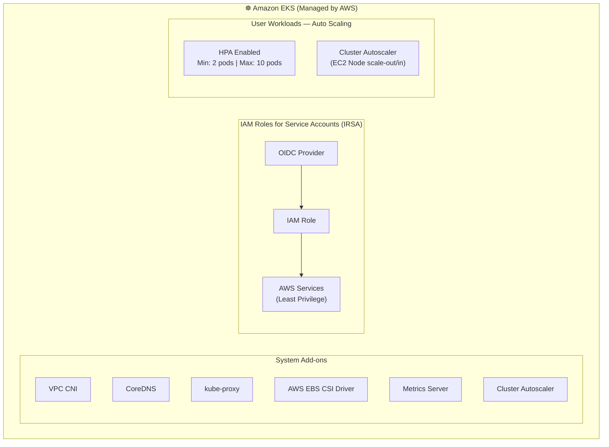
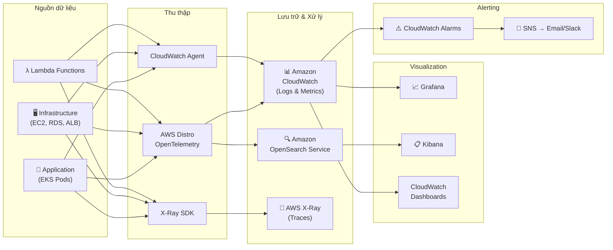
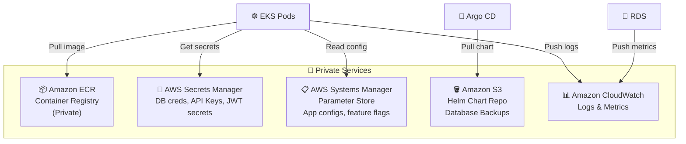

# AWS Resources — JobBridge AI

> Region: **us-east-1** | Cluster: **Amazon EKS (Managed)**

---

## Danh sách tài nguyên tổng quan

| Nhóm | Service | Mục đích |
|---|---|---|
| Compute | Amazon EKS | Chạy toàn bộ workload container |
| Database | Amazon RDS (PostgreSQL) | Lưu trữ dữ liệu chính |
| Container Registry | Amazon ECR | Private Docker image registry |
| Load Balancing | Application Load Balancer | HTTPS ingress, SSL termination |
| DNS | Amazon Route 53 | DNS routing cho domain |
| Security | AWS WAF | Web Application Firewall |
| Secrets | AWS Secrets Manager | Database credentials, API keys |
| Config | AWS Systems Manager (Parameter Store) | App configuration, feature flags |
| Storage | Amazon S3 | Helm chart repo, backups |
| Messaging | Amazon SNS | Event notifications, email topics |
| Queue | Amazon SQS | Email queue, async job queue |
| Serverless | AWS Lambda | Email sender, job processor, alarm handler |
| Email | Amazon SES | Gửi email transactional |
| Monitoring | Amazon CloudWatch | Logs, metrics, alarms |
| Tracing | AWS X-Ray | Distributed tracing |
| Telemetry | AWS Distro for OpenTelemetry | Traces & metrics pipeline |
| Search/Logs | Amazon OpenSearch Service | Log aggregation, search |
| Visualization | Grafana / Kibana | Dashboard, log visualization |
| CI/CD | GitHub Actions + Argo CD | Pipeline và GitOps deploy |
| Image Scanning | Trivy | Container vulnerability scanning |

---

## Mermaid — Toàn bộ luồng request (End-to-End)

---

## Mermaid — CI/CD Pipeline

---

## Mermaid — Serverless & Messaging

---

## Mermaid — EKS Cluster Internal (Addons + IRSA)

---

## Mermaid — Observability Stack

---

## Mermaid — Private Services (Support Infrastructure)

---

## Resource Sizing (Tham khảo)

| Resource | Loại / Size | Ghi chú |
|---|---|---|
| EKS Node Group | t3.medium (mỗi AZ) | Min: 1, Max: 5 per AZ |
| RDS PostgreSQL | db.t3.medium | Multi-AZ, 100 GB storage |
| ALB | - | 1 ALB cho toàn bộ |
| NAT Gateway | - | 1 per AZ (đề xuất HA) |
| ECR | - | Image scanning bật |
| S3 | Standard | Versioning + lifecycle policy |
| SQS | Standard Queue | 4 queues: email, job, DLQ x2 |
| Lambda | 512MB, 15s timeout | 3 functions |
| SES | - | Verify domain + DKIM |

---

## Lưu ý kiến trúc (Known Issues)

| # | Vấn đề | Đề xuất |
|---|---|---|
| 1 | API Gateway dùng Node.js/Go — nếu là 2 service riêng thì cần tách rõ | Xác định rõ: 1 service Node.js làm gateway hay Go microservice? |
| 2 | AI Service không có queue, gọi sync | Nên thêm SQS queue trước AI Service để tránh timeout |
| 3 | RDS Proxy chưa thấy rõ trong diagram gốc | Thêm RDS Proxy để quản lý connection pooling |
| 4 | Không thấy Redis/ElastiCache | Nên thêm cache layer cho session và API cache |
| 5 | Argo CD không có RBAC rõ ràng | Cần định nghĩa Argo CD projects và AppProjects per team |
