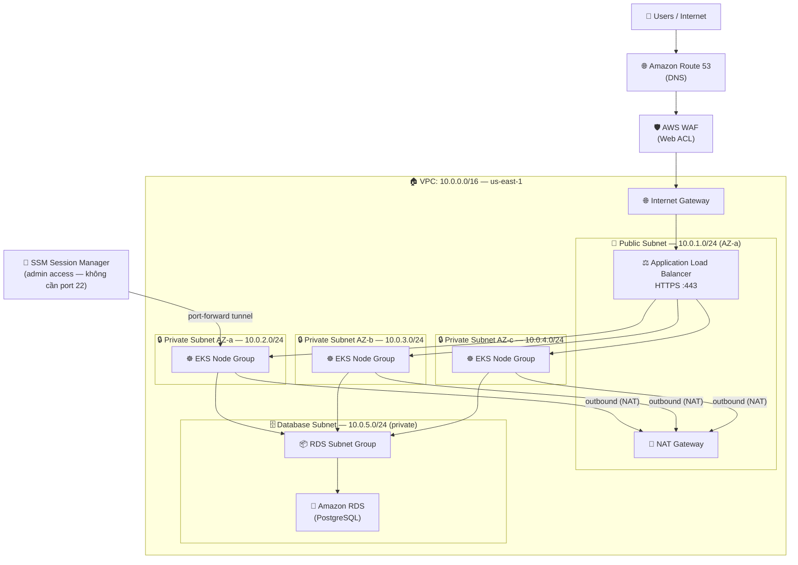

# 01 — Network Topology (VPC Overview)

> Toàn bộ VPC: subnet layout, Internet Gateway, NAT, EKS nodes, RDS — truy cập admin qua SSM Session Manager (không cần Bastion)

```mermaid
graph TB
    USERS["👥 Users / Internet"]
    R53["🌐 Amazon Route 53\n(DNS)"]
    WAF["🛡️ AWS WAF\n(Web ACL)"]
    SSM["🔑 SSM Session Manager\n(admin access — không cần port 22)"]

    subgraph VPC["🏠 VPC: 10.0.0.0/16  —  us-east-1"]
        IGW["🌐 Internet Gateway"]

        subgraph PUBLIC["📡 Public Subnet — 10.0.1.0/24  (AZ-a)"]
            ALB["⚖️ Application Load Balancer\nHTTPS :443"]
            NAT["🔀 NAT Gateway"]
        end

        subgraph PRIVATE_A["🔒 Private Subnet AZ-a — 10.0.2.0/24"]
            EKS_A["☸️ EKS Node Group"]
        end

        subgraph PRIVATE_B["🔒 Private Subnet AZ-b — 10.0.3.0/24"]
            EKS_B["☸️ EKS Node Group"]
        end

        subgraph PRIVATE_C["🔒 Private Subnet AZ-c — 10.0.4.0/24"]
            EKS_C["☸️ EKS Node Group"]
        end

        subgraph DB_SUBNET["🗄️ Database Subnet — 10.0.5.0/24 (private)"]
            RDS_GROUP["📦 RDS Subnet Group"]
            RDS["🐘 Amazon RDS\n(PostgreSQL)"]
        end
    end

    %% Inbound: Internet → IGW → ALB → EKS
    USERS --> R53 --> WAF --> IGW --> ALB
    ALB --> EKS_A & EKS_B & EKS_C

    %% Outbound: EKS → NAT → IGW → Internet
    EKS_A & EKS_B & EKS_C -->|"outbound (NAT)"| NAT

    %% Admin access: SSM Session Manager (không cần Bastion/port 22)
    SSM -->|"port-forward tunnel"| EKS_A

    %% Database tier
    EKS_A & EKS_B & EKS_C --> RDS_GROUP --> RDS
```
