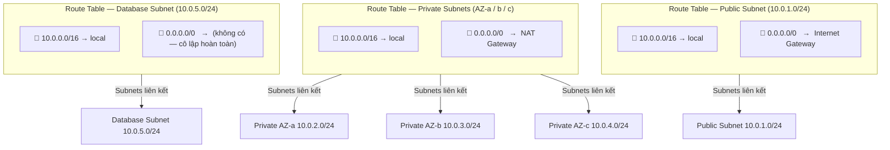

# 02 — Routing Tables

> Route table của từng subnet: public, private, database

```mermaid
graph TB
    subgraph RT_PUBLIC["Route Table — Public Subnet (10.0.1.0/24)"]
        direction TB
        RP1["📌 10.0.0.0/16  →  local"]
        RP2["📌 0.0.0.0/0   →  Internet Gateway"]
    end

    subgraph RT_PRIVATE["Route Table — Private Subnets (AZ-a / b / c)"]
        direction TB
        RR1["📌 10.0.0.0/16  →  local"]
        RR2["📌 0.0.0.0/0   →  NAT Gateway"]
    end

    subgraph RT_DB["Route Table — Database Subnet (10.0.5.0/24)"]
        direction TB
        RD1["📌 10.0.0.0/16  →  local"]
        RD2["🚫 0.0.0.0/0   →  (không có — cô lập hoàn toàn)"]
    end

    RT_PUBLIC -->|"Subnets liên kết"| SN_PUB["Public Subnet 10.0.1.0/24"]
    RT_PRIVATE -->|"Subnets liên kết"| SN_PA["Private AZ-a 10.0.2.0/24"]
    RT_PRIVATE -->|"Subnets liên kết"| SN_PB["Private AZ-b 10.0.3.0/24"]
    RT_PRIVATE -->|"Subnets liên kết"| SN_PC["Private AZ-c 10.0.4.0/24"]
    RT_DB -->|"Subnets liên kết"| SN_DB["Database Subnet 10.0.5.0/24"]
```
