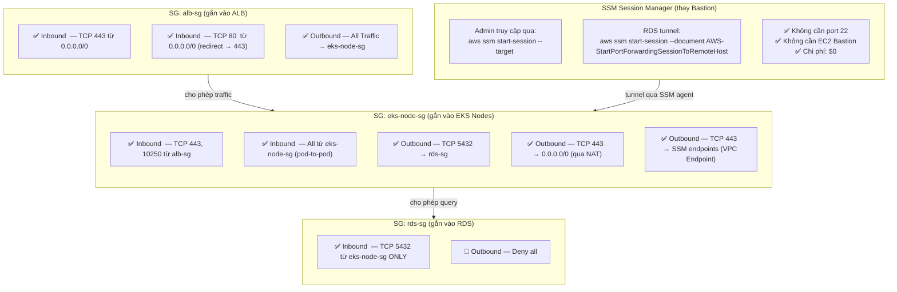

# 03 — Security Groups

> Inbound/outbound rules của từng Security Group — không có bastion-sg (dùng SSM Session Manager thay thế)

```mermaid
graph TB
    subgraph SG_ALB["SG: alb-sg  (gắn vào ALB)"]
        direction TB
        A1["✅ Inbound  — TCP 443 từ 0.0.0.0/0"]
        A2["✅ Inbound  — TCP 80  từ 0.0.0.0/0 (redirect → 443)"]
        A3["✅ Outbound — All Traffic → eks-node-sg"]
    end

    subgraph SG_EKS["SG: eks-node-sg  (gắn vào EKS Nodes)"]
        direction TB
        B1["✅ Inbound  — TCP 443, 10250 từ alb-sg"]
        B2["✅ Inbound  — All từ eks-node-sg (pod-to-pod)"]
        B3["✅ Outbound — TCP 5432 → rds-sg"]
        B4["✅ Outbound — TCP 443  → 0.0.0.0/0 (qua NAT)"]
        B5["✅ Outbound — TCP 443  → SSM endpoints (VPC Endpoint)"]
    end

    subgraph SG_RDS["SG: rds-sg  (gắn vào RDS)"]
        direction TB
        C1["✅ Inbound  — TCP 5432 từ eks-node-sg ONLY"]
        C2["🚫 Outbound — Deny all"]
    end

    subgraph SSM_NOTE["SSM Session Manager (thay Bastion)"]
        direction TB
        S1["Admin truy cập qua:\naws ssm start-session --target <node-id>"]
        S2["RDS tunnel:\naws ssm start-session --document AWS-StartPortForwardingSessionToRemoteHost"]
        S3["✅ Không cần port 22\n✅ Không cần EC2 Bastion\n✅ Chi phí: $0"]
    end

    SG_ALB -->|"cho phép traffic"| SG_EKS
    SG_EKS -->|"cho phép query"| SG_RDS
    SSM_NOTE -->|"tunnel qua SSM agent"| SG_EKS
```
