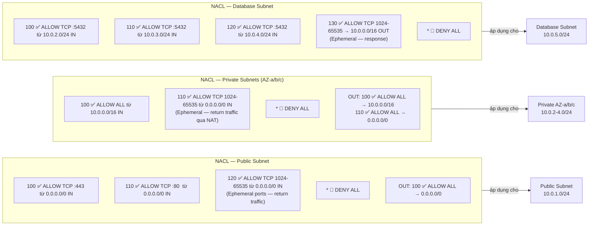

# 04 — Network ACLs (NACLs)

> Stateless firewall tầng subnet — các rule inbound theo priority number

```mermaid
graph LR
    subgraph NACL_PUBLIC["NACL — Public Subnet"]
        direction TB
        NP1["100 ✅ ALLOW TCP :443 từ 0.0.0.0/0 IN"]
        NP2["110 ✅ ALLOW TCP :80  từ 0.0.0.0/0 IN"]
        NP3["120 ✅ ALLOW TCP 1024-65535 từ 0.0.0.0/0 IN\n(Ephemeral ports — return traffic)"]
        NP4["*   🚫 DENY  ALL"]
        NP_OUT["OUT: 100 ✅ ALLOW ALL → 0.0.0.0/0"]
    end

    subgraph NACL_PRIVATE["NACL — Private Subnets (AZ-a/b/c)"]
        direction TB
        NR1["100 ✅ ALLOW ALL từ 10.0.0.0/16 IN"]
        NR2["110 ✅ ALLOW TCP 1024-65535 từ 0.0.0.0/0 IN\n(Ephemeral — return traffic qua NAT)"]
        NR3["*   🚫 DENY  ALL"]
        NR_OUT["OUT: 100 ✅ ALLOW ALL → 10.0.0.0/16\n     110 ✅ ALLOW ALL → 0.0.0.0/0"]
    end

    subgraph NACL_DB["NACL — Database Subnet"]
        direction TB
        ND1["100 ✅ ALLOW TCP :5432 từ 10.0.2.0/24 IN"]
        ND2["110 ✅ ALLOW TCP :5432 từ 10.0.3.0/24 IN"]
        ND3["120 ✅ ALLOW TCP :5432 từ 10.0.4.0/24 IN"]
        ND4["130 ✅ ALLOW TCP 1024-65535 → 10.0.0.0/16 OUT\n(Ephemeral — response)"]
        ND5["*   🚫 DENY  ALL"]
    end

    NACL_PUBLIC  -->|"áp dụng cho"| S1["Public Subnet\n10.0.1.0/24"]
    NACL_PRIVATE -->|"áp dụng cho"| S2["Private AZ-a/b/c\n10.0.2-4.0/24"]
    NACL_DB      -->|"áp dụng cho"| S3["Database Subnet\n10.0.5.0/24"]
```
