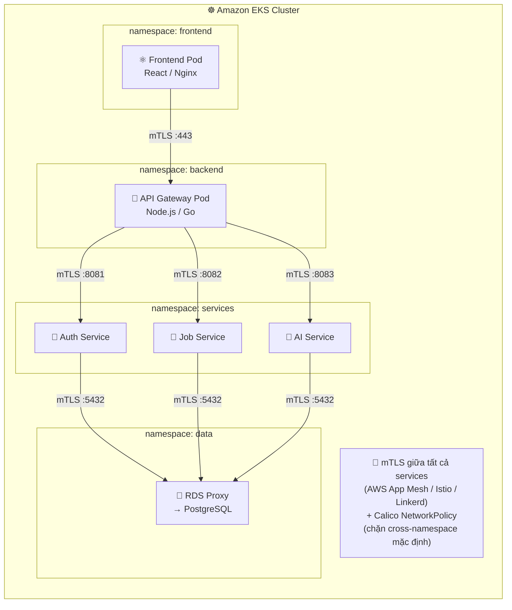

# 05 — Internal Traffic (mTLS + Network Policies)

> Luồng giao tiếp giữa các service bên trong EKS qua mTLS và Calico Network Policies

```mermaid
graph LR
    subgraph EKS["☸️ Amazon EKS Cluster"]

        subgraph NS_FE["namespace: frontend"]
            FE["⚛️ Frontend Pod\nReact / Nginx"]
        end

        subgraph NS_BE["namespace: backend"]
            GW["🔀 API Gateway Pod\nNode.js / Go"]
        end

        subgraph NS_SVC["namespace: services"]
            AUTH["🔐 Auth Service"]
            JOB["💼 Job Service"]
            AI["🤖 AI Service"]
        end

        subgraph NS_DATA["namespace: data"]
            RDS_PROXY["🐘 RDS Proxy\n→ PostgreSQL"]
        end

        MTLS_NOTE["🔐 mTLS giữa tất cả services\n(AWS App Mesh / Istio / Linkerd)\n+ Calico NetworkPolicy\n(chặn cross-namespace mặc định)"]
    end

    FE    -->|"mTLS :443"| GW
    GW    -->|"mTLS :8081"| AUTH
    GW    -->|"mTLS :8082"| JOB
    GW    -->|"mTLS :8083"| AI
    AUTH  -->|"mTLS :5432"| RDS_PROXY
    JOB   -->|"mTLS :5432"| RDS_PROXY
    AI    -->|"mTLS :5432"| RDS_PROXY
```
