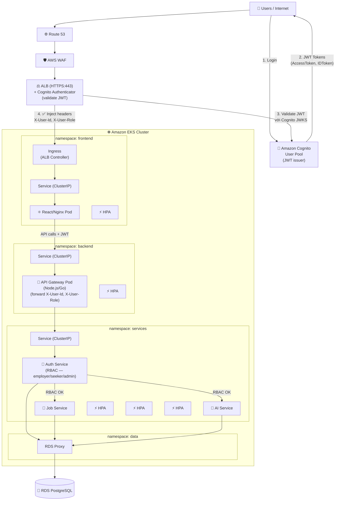

# 06 — Request Flow End-to-End

> Toàn bộ luồng request từ người dùng vào hệ thống đến database (bao gồm Cognito auth)

```mermaid
graph TB
    USER["👥 Users / Internet"]
    R53["🌐 Route 53"]
    WAF["🛡️ AWS WAF"]
    COGNITO["🔐 Amazon Cognito\nUser Pool\n(JWT issuer)"]
    ALB["⚖️ ALB (HTTPS:443)\n+ Cognito Authenticator\n(validate JWT)"]

    subgraph EKS["☸️ Amazon EKS Cluster"]

        subgraph NS_FE["namespace: frontend"]
            FE_ING["Ingress\n(ALB Controller)"]
            FE_SVC["Service (ClusterIP)"]
            FE["⚛️ React/Nginx Pod"]
            FE_HPA["⚡ HPA"]
        end

        subgraph NS_BE["namespace: backend"]
            GW_SVC["Service (ClusterIP)"]
            GW["🔀 API Gateway Pod\n(Node.js/Go)\n(forward X-User-Id, X-User-Role)"]
            GW_HPA["⚡ HPA"]
        end

        subgraph NS_SVC["namespace: services"]
            SVC_SVC["Service (ClusterIP)"]
            AUTH["🔐 Auth Service\n(RBAC — employer/seeker/admin)"]
            JOB["💼 Job Service"]
            AI["🤖 AI Service"]
            AUTH_HPA["⚡ HPA"]
            JOB_HPA["⚡ HPA"]
            AI_HPA["⚡ HPA"]
        end

        subgraph NS_DATA["namespace: data"]
            RDS_PROXY["RDS Proxy"]
        end
    end

    RDS[("🐘 RDS PostgreSQL")]

    %% Auth flow: user đăng nhập lấy JWT từ Cognito
    USER -->|"1. Login"| COGNITO
    COGNITO -->|"2. JWT Tokens\n(AccessToken, IDToken)"| USER

    %% Request flow: JWT đính kèm vào request, ALB validate
    USER --> R53 --> WAF --> ALB
    ALB -->|"3. Validate JWT\nvới Cognito JWKS"| COGNITO
    ALB -->|"4. ✅ Inject headers\nX-User-Id, X-User-Role"| FE_ING
    FE_ING --> FE_SVC --> FE
    FE -->|"API calls + JWT"| GW_SVC --> GW
    GW --> SVC_SVC
    SVC_SVC --> AUTH
    AUTH -->|"RBAC OK"| JOB & AI
    AUTH & JOB & AI --> RDS_PROXY --> RDS
```
