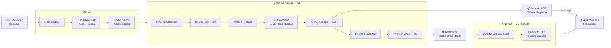

# 07 — CI/CD Pipeline

> Luồng từ code commit đến deploy lên EKS qua GitHub Actions + Argo CD (GitOps)

```mermaid
graph LR
    DEV["👨‍💻 Developer\n(git push)"]

    subgraph GITHUB["GitHub"]
        REPO["📁 Repository"]
        PR["🔀 Pull Request\n+ Code Review"]
        MAIN["🌿 main branch\n(merge trigger)"]
    end

    subgraph CI["⚙️ GitHub Actions — CI"]
        direction TB
        S1["1️⃣ Code Checkout"]
        S2["2️⃣ Unit Test + Lint"]
        S3["3️⃣ Docker Build"]
        S4["4️⃣ Trivy Scan\n(CVE / Secret scan)"]
        S5["5️⃣ Push Image → ECR"]
        S6["6️⃣ Helm Package"]
        S7["7️⃣ Push Chart → S3"]
        S1 --> S2 --> S3 --> S4 --> S5 --> S6 --> S7
    end

    ECR["📦 Amazon ECR\n(Private Registry)"]
    S3_HELM["🪣 Amazon S3\n(Helm Chart Repo)"]

    subgraph CD["🐙 Argo CD — CD (GitOps)"]
        direction TB
        ARGO_SYNC["Sync từ S3 Helm chart"]
        ARGO_DEPLOY["Deploy to EKS\n(Rolling update)"]
        ARGO_SYNC --> ARGO_DEPLOY
    end

    EKS["☸️ Amazon EKS\n(Production)"]

    DEV --> REPO --> PR --> MAIN --> CI
    S5 --> ECR
    S7 --> S3_HELM
    S3_HELM --> ARGO_SYNC
    ECR -->|"pull image"| EKS
    ARGO_DEPLOY --> EKS
```
