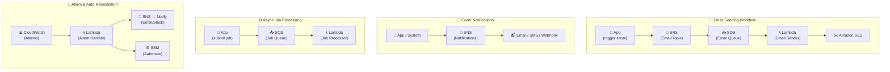

# 08 — Serverless & Messaging Architecture

> 4 luồng: Email sending, Event notification, Async job processing, Alarm & auto-remediation

```mermaid
graph TB

    subgraph EMAIL["📧 Email Sending Workflow"]
        direction LR
        APP_EMAIL["📱 App\n(trigger email)"]
        SNS_EMAIL["📢 SNS\n(Email Topic)"]
        SQS_EMAIL["📥 SQS\n(Email Queue)"]
        L_EMAIL["λ Lambda\n(Email Sender)"]
        SES["✉️ Amazon SES"]
        APP_EMAIL --> SNS_EMAIL --> SQS_EMAIL --> L_EMAIL --> SES
    end

    subgraph EVENT["🔔 Event Notifications"]
        direction LR
        APP_EV["📱 App / System"]
        SNS_EV["📢 SNS\n(Notifications)"]
        DEST["📬 Email / SMS / Webhook"]
        APP_EV --> SNS_EV --> DEST
    end

    subgraph ASYNC["⚙️ Async Job Processing"]
        direction LR
        APP_JOB["📱 App\n(submit job)"]
        SQS_JOB["📥 SQS\n(Job Queue)"]
        L_JOB["λ Lambda\n(Job Processor)"]
        APP_JOB --> SQS_JOB --> L_JOB
    end

    subgraph ALARM["🚨 Alarm & Auto-Remediation"]
        direction LR
        CW["📊 CloudWatch\n(Alarms)"]
        L_ALARM["λ Lambda\n(Alarm Handler)"]
        SNS_NOTIFY["📢 SNS → Notify\n(Email/Slack)"]
        SSM["⚙️ SSM\n(Automate)"]
        CW --> L_ALARM --> SNS_NOTIFY & SSM
    end
```
