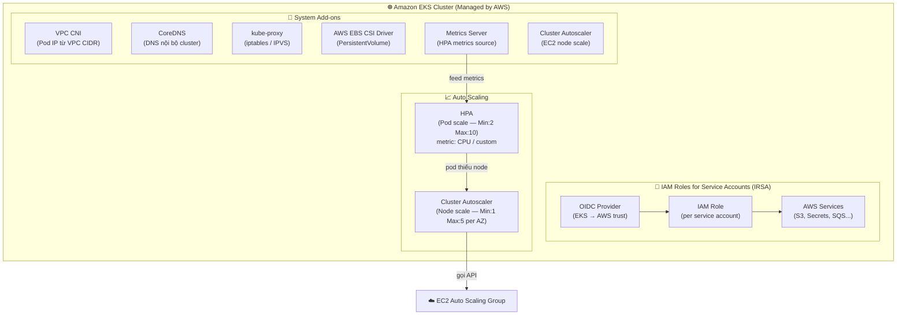

# 09 — EKS Add-ons & Auto Scaling

> System add-ons, IRSA (pod-level IAM), HPA và Cluster Autoscaler

```mermaid
graph TB

    subgraph EKS["☸️ Amazon EKS Cluster (Managed by AWS)"]

        subgraph ADDONS["🔧 System Add-ons"]
            VPC_CNI["VPC CNI\n(Pod IP từ VPC CIDR)"]
            COREDNS["CoreDNS\n(DNS nội bộ cluster)"]
            KUBE_PROXY["kube-proxy\n(iptables / IPVS)"]
            EBS_CSI["AWS EBS CSI Driver\n(PersistentVolume)"]
            METRICS["Metrics Server\n(HPA metrics source)"]
            AUTOSCALER["Cluster Autoscaler\n(EC2 node scale)"]
        end

        subgraph IRSA["🔐 IAM Roles for Service Accounts (IRSA)"]
            OIDC["OIDC Provider\n(EKS → AWS trust)"]
            IAM_ROLE["IAM Role\n(per service account)"]
            AWS_SVC["AWS Services\n(S3, Secrets, SQS...)"]
            OIDC --> IAM_ROLE --> AWS_SVC
        end

        subgraph SCALE["📈 Auto Scaling"]
            HPA["HPA\n(Pod scale — Min:2 Max:10)\nmetric: CPU / custom"]
            CA["Cluster Autoscaler\n(Node scale — Min:1 Max:5 per AZ)"]
            HPA -->|"pod thiếu node"| CA
        end
    end

    METRICS -->|"feed metrics"| HPA
    CA -->|"gọi API"| EC2["☁️ EC2 Auto Scaling Group"]
```
