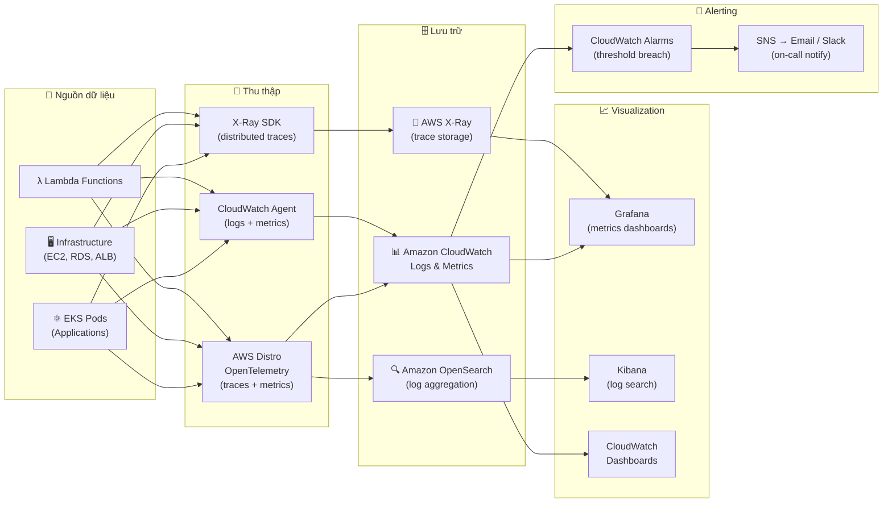

# 10 — Observability & Logging Stack

> Thu thập → Lưu trữ → Visualize → Alert cho toàn bộ hệ thống

```mermaid
graph LR

    subgraph SRC["📡 Nguồn dữ liệu"]
        APP["⚛️ EKS Pods\n(Applications)"]
        INFRA["🖥️ Infrastructure\n(EC2, RDS, ALB)"]
        LAMBDA["λ Lambda Functions"]
    end

    subgraph COLLECT["🔬 Thu thập"]
        OTEL["AWS Distro\nOpenTelemetry\n(traces + metrics)"]
        CW_AGENT["CloudWatch Agent\n(logs + metrics)"]
        XRAY_SDK["X-Ray SDK\n(distributed traces)"]
    end

    subgraph STORE["🗄️ Lưu trữ"]
        CW["📊 Amazon CloudWatch\nLogs & Metrics"]
        OPENSEARCH["🔍 Amazon OpenSearch\n(log aggregation)"]
        XRAY["🔎 AWS X-Ray\n(trace storage)"]
    end

    subgraph VIZ["📈 Visualization"]
        GRAFANA["Grafana\n(metrics dashboards)"]
        KIBANA["Kibana\n(log search)"]
        CW_DASH["CloudWatch\nDashboards"]
    end

    subgraph ALERT["🚨 Alerting"]
        CW_ALARM["CloudWatch Alarms\n(threshold breach)"]
        SNS_ALERT["SNS → Email / Slack\n(on-call notify)"]
    end

    APP & INFRA & LAMBDA --> OTEL & CW_AGENT & XRAY_SDK
    OTEL --> CW & OPENSEARCH
    CW_AGENT --> CW
    XRAY_SDK --> XRAY
    CW --> GRAFANA & CW_DASH & CW_ALARM
    OPENSEARCH --> KIBANA
    XRAY --> GRAFANA
    CW_ALARM --> SNS_ALERT
```
