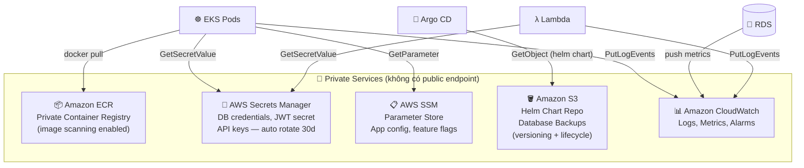

# 11 — Private Support Services

> Các dịch vụ AWS managed hỗ trợ toàn hệ thống: ECR, Secrets, S3, SSM, CloudWatch

```mermaid
graph TB

    subgraph PRIVATE["🔐 Private Services (không có public endpoint)"]
        ECR["📦 Amazon ECR\nPrivate Container Registry\n(image scanning enabled)"]
        SECRETS["🔑 AWS Secrets Manager\nDB credentials, JWT secret\nAPI keys — auto rotate 30d"]
        PARAM["📋 AWS SSM\nParameter Store\nApp config, feature flags"]
        S3["🪣 Amazon S3\nHelm Chart Repo\nDatabase Backups\n(versioning + lifecycle)"]
        CW["📊 Amazon CloudWatch\nLogs, Metrics, Alarms"]
    end

    EKS["☸️ EKS Pods"]
    ARGO["🐙 Argo CD"]
    RDS[("🐘 RDS")]
    LAMBDA["λ Lambda"]

    EKS     -->|"docker pull"| ECR
    EKS     -->|"GetSecretValue"| SECRETS
    EKS     -->|"GetParameter"| PARAM
    EKS     -->|"PutLogEvents"| CW
    ARGO    -->|"GetObject (helm chart)"| S3
    RDS     -->|"push metrics"| CW
    LAMBDA  -->|"PutLogEvents"| CW
    LAMBDA  -->|"GetSecretValue"| SECRETS
```
