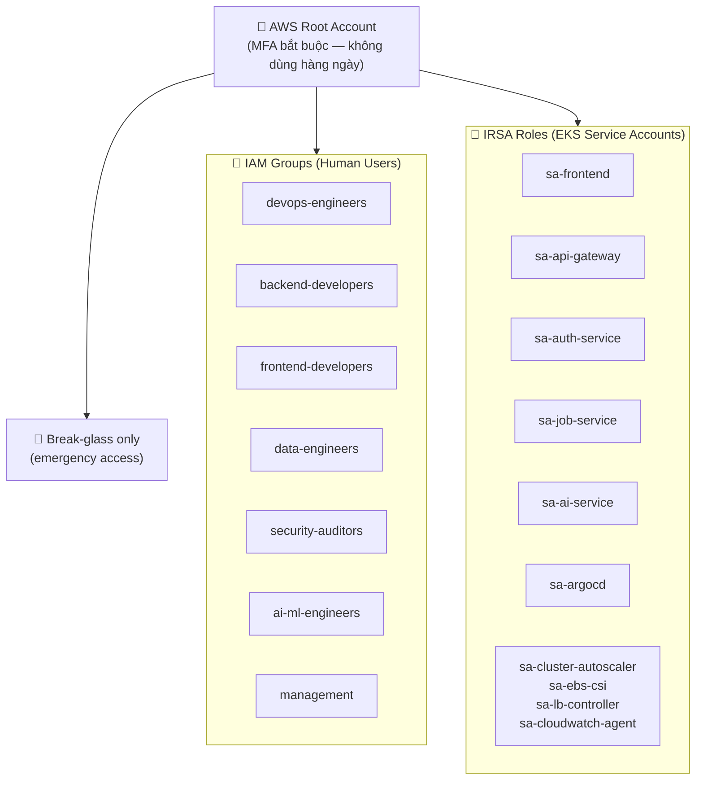

# 12 — IAM Hierarchy Overview

> Cấu trúc phân cấp: Root → Groups (teams) + Service Account Roles (IRSA)

```mermaid
graph TB
    ROOT["🔐 AWS Root Account\n(MFA bắt buộc — không dùng hàng ngày)"]
    BREAK["🚨 Break-glass only\n(emergency access)"]

    subgraph GROUPS["👥 IAM Groups (Human Users)"]
        GRP_DEVOPS["devops-engineers"]
        GRP_BACKEND["backend-developers"]
        GRP_FRONTEND["frontend-developers"]
        GRP_DATA["data-engineers"]
        GRP_SECURITY["security-auditors"]
        GRP_AI["ai-ml-engineers"]
        GRP_MGMT["management"]
    end

    subgraph IRSA["🤖 IRSA Roles (EKS Service Accounts)"]
        SA_FE["sa-frontend"]
        SA_GW["sa-api-gateway"]
        SA_AUTH["sa-auth-service"]
        SA_JOB["sa-job-service"]
        SA_AI["sa-ai-service"]
        SA_ARGO["sa-argocd"]
        SA_SYS["sa-cluster-autoscaler\nsa-ebs-csi\nsa-lb-controller\nsa-cloudwatch-agent"]
    end

    ROOT --> BREAK
    ROOT --> GROUPS
    ROOT --> IRSA
```
