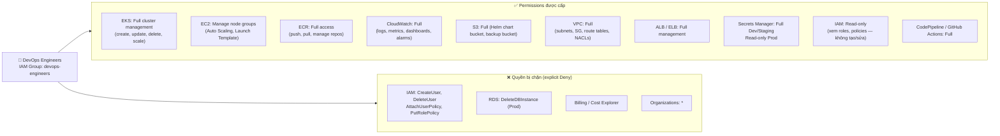

# 13 — IAM: DevOps / Platform Team

> Quyền hạn của nhóm devops-engineers — full infra, giới hạn billing & IAM write

```mermaid
graph LR
    USER["👤 DevOps Engineers\nIAM Group: devops-engineers"]

    subgraph ALLOW["✅ Permissions được cấp"]
        direction TB
        P1["EKS: Full cluster management\n(create, update, delete, scale)"]
        P2["EC2: Manage node groups\n(Auto Scaling, Launch Template)"]
        P3["ECR: Full access\n(push, pull, manage repos)"]
        P4["CloudWatch: Full\n(logs, metrics, dashboards, alarms)"]
        P5["S3: Full (Helm chart bucket, backup bucket)"]
        P6["VPC: Full\n(subnets, SG, route tables, NACLs)"]
        P7["ALB / ELB: Full management"]
        P8["Secrets Manager: Full Dev/Staging\nRead-only Prod"]
        P9["IAM: Read-only\n(xem roles, policies — không tạo/sửa)"]
        P10["CodePipeline / GitHub Actions: Full"]
    end

    subgraph DENY["❌ Quyền bị chặn (explicit Deny)"]
        direction TB
        D1["IAM: CreateUser, DeleteUser\nAttachUserPolicy, PutRolePolicy"]
        D2["RDS: DeleteDBInstance (Prod)"]
        D3["Billing / Cost Explorer"]
        D4["Organizations: *"]
    end

    USER --> ALLOW
    USER --> DENY
```
