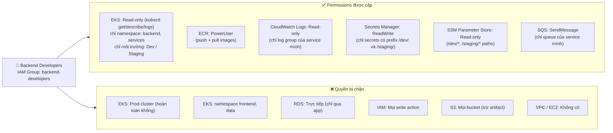

# 14 — IAM: Backend Team

> Quyền hạn của nhóm backend-developers — chỉ namespace backend/services, không có prod

```mermaid
graph LR
    USER["👤 Backend Developers\nIAM Group: backend-developers"]

    subgraph ALLOW["✅ Permissions được cấp"]
        direction TB
        P1["EKS: Read-only (kubectl get/describe/logs)\nchỉ namespace: backend, services\nchỉ môi trường: Dev / Staging"]
        P2["ECR: PowerUser\n(push + pull images)"]
        P3["CloudWatch Logs: Read-only\n(chỉ log group của service mình)"]
        P4["Secrets Manager: ReadWrite\n(chỉ secrets có prefix /dev/ và /staging/)"]
        P5["SSM Parameter Store: Read-only\n(/dev/*, /staging/* paths)"]
        P6["SQS: SendMessage\n(chỉ queue của service mình)"]
    end

    subgraph DENY["❌ Quyền bị chặn"]
        direction TB
        D1["EKS: Prod cluster (hoàn toàn không)"]
        D2["EKS: namespace frontend, data"]
        D3["RDS: Trực tiếp (chỉ qua app)"]
        D4["IAM: Mọi write action"]
        D5["S3: Mọi bucket (trừ artifact)"]
        D6["VPC / EC2: Không có"]
    end

    USER --> ALLOW
    USER --> DENY
```
