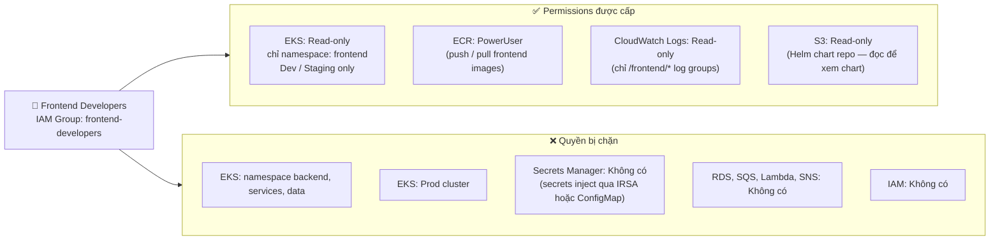

# 15 — IAM: Frontend Team

> Quyền hạn của nhóm frontend-developers — chỉ namespace frontend

```mermaid
graph LR
    USER["👤 Frontend Developers\nIAM Group: frontend-developers"]

    subgraph ALLOW["✅ Permissions được cấp"]
        direction TB
        P1["EKS: Read-only\nchỉ namespace: frontend\nDev / Staging only"]
        P2["ECR: PowerUser\n(push / pull frontend images)"]
        P3["CloudWatch Logs: Read-only\n(chỉ /frontend/* log groups)"]
        P4["S3: Read-only\n(Helm chart repo — đọc để xem chart)"]
    end

    subgraph DENY["❌ Quyền bị chặn"]
        direction TB
        D1["EKS: namespace backend, services, data"]
        D2["EKS: Prod cluster"]
        D3["Secrets Manager: Không có\n(secrets inject qua IRSA hoặc ConfigMap)"]
        D4["RDS, SQS, Lambda, SNS: Không có"]
        D5["IAM: Không có"]
    end

    USER --> ALLOW
    USER --> DENY
```
