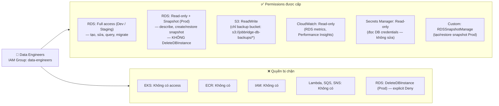

# 16 — IAM: Data / DB Team

> Quyền hạn của nhóm data-engineers — RDS full (dev), read-only + snapshot (prod)

```mermaid
graph LR
    USER["👤 Data Engineers\nIAM Group: data-engineers"]

    subgraph ALLOW["✅ Permissions được cấp"]
        direction TB
        P1["RDS: Full access (Dev / Staging)\n— tạo, sửa, query, migrate"]
        P2["RDS: Read-only + Snapshot (Prod)\n— describe, create/restore snapshot\n— KHÔNG DeleteDBInstance"]
        P3["S3: ReadWrite\n(chỉ backup bucket: s3://jobbridge-db-backups/*)"]
        P4["CloudWatch: Read-only\n(RDS metrics, Performance Insights)"]
        P5["Secrets Manager: Read-only\n(đọc DB credentials — không sửa)"]
        P6["Custom: RDSSnapshotManage\n(tạo/restore snapshot Prod)"]
    end

    subgraph DENY["❌ Quyền bị chặn"]
        direction TB
        D1["EKS: Không có access"]
        D2["ECR: Không có"]
        D3["IAM: Không có"]
        D4["Lambda, SQS, SNS: Không có"]
        D5["RDS: DeleteDBInstance (Prod) — explicit Deny"]
    end

    USER --> ALLOW
    USER --> DENY
```
