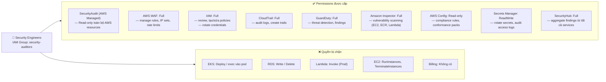

# 17 — IAM: Security Team

> Quyền hạn của nhóm security-auditors — read-only toàn hệ thống + WAF + GuardDuty + IAM review

```mermaid
graph LR
    USER["👤 Security Engineers\nIAM Group: security-auditors"]

    subgraph ALLOW["✅ Permissions được cấp"]
        direction TB
        P1["SecurityAudit (AWS Managed)\n— Read-only toàn bộ AWS resources"]
        P2["AWS WAF: Full\n— manage rules, IP sets, rate limits"]
        P3["IAM: Full\n— review, tạo/sửa policies\n— rotate credentials"]
        P4["CloudTrail: Full\n— audit logs, create trails"]
        P5["GuardDuty: Full\n— threat detection, findings"]
        P6["Amazon Inspector: Full\n— vulnerability scanning (EC2, ECR, Lambda)"]
        P7["AWS Config: Read-only\n— compliance rules, conformance packs"]
        P8["Secrets Manager: ReadWrite\n— rotate secrets, audit access logs"]
        P9["SecurityHub: Full\n— aggregate findings từ tất cả services"]
    end

    subgraph DENY["❌ Quyền bị chặn"]
        direction TB
        D1["EKS: Deploy / exec vào pod"]
        D2["RDS: Write / Delete"]
        D3["Lambda: Invoke (Prod)"]
        D4["EC2: RunInstances, TerminateInstances"]
        D5["Billing: Không có"]
    end

    USER --> ALLOW
    USER --> DENY
```
