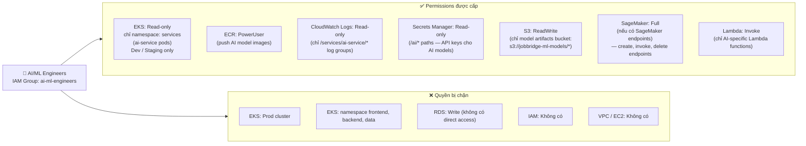

# 18 — IAM: AI/ML Team

> Quyền hạn của nhóm ai-ml-engineers — namespace services/ai-service + model artifacts

```mermaid
graph LR
    USER["👤 AI/ML Engineers\nIAM Group: ai-ml-engineers"]

    subgraph ALLOW["✅ Permissions được cấp"]
        direction TB
        P1["EKS: Read-only\nchỉ namespace: services\n(ai-service pods)\nDev / Staging only"]
        P2["ECR: PowerUser\n(push AI model images)"]
        P3["CloudWatch Logs: Read-only\n(chỉ /services/ai-service/* log groups)"]
        P4["Secrets Manager: Read-only\n(/ai/* paths — API keys cho AI models)"]
        P5["S3: ReadWrite\n(chỉ model artifacts bucket:\ns3://jobbridge-ml-models/*)"]
        P6["SageMaker: Full\n(nếu có SageMaker endpoints)\n— create, invoke, delete endpoints"]
        P7["Lambda: Invoke\n(chỉ AI-specific Lambda functions)"]
    end

    subgraph DENY["❌ Quyền bị chặn"]
        direction TB
        D1["EKS: Prod cluster"]
        D2["EKS: namespace frontend, backend, data"]
        D3["RDS: Write (không có direct access)"]
        D4["IAM: Không có"]
        D5["VPC / EC2: Không có"]
    end

    USER --> ALLOW
    USER --> DENY
```
