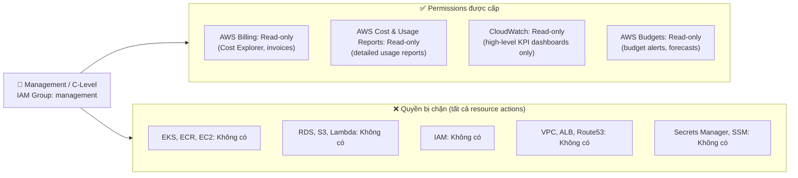

# 19 — IAM: Management

> Quyền hạn của nhóm management — chỉ billing và cost reports, không có resource access

```mermaid
graph LR
    USER["👤 Management / C-Level\nIAM Group: management"]

    subgraph ALLOW["✅ Permissions được cấp"]
        direction TB
        P1["AWS Billing: Read-only\n(Cost Explorer, invoices)"]
        P2["AWS Cost & Usage Reports: Read-only\n(detailed usage reports)"]
        P3["CloudWatch: Read-only\n(high-level KPI dashboards only)"]
        P4["AWS Budgets: Read-only\n(budget alerts, forecasts)"]
    end

    subgraph DENY["❌ Quyền bị chặn (tất cả resource actions)"]
        direction TB
        D1["EKS, ECR, EC2: Không có"]
        D2["RDS, S3, Lambda: Không có"]
        D3["IAM: Không có"]
        D4["VPC, ALB, Route53: Không có"]
        D5["Secrets Manager, SSM: Không có"]
    end

    USER --> ALLOW
    USER --> DENY
```
