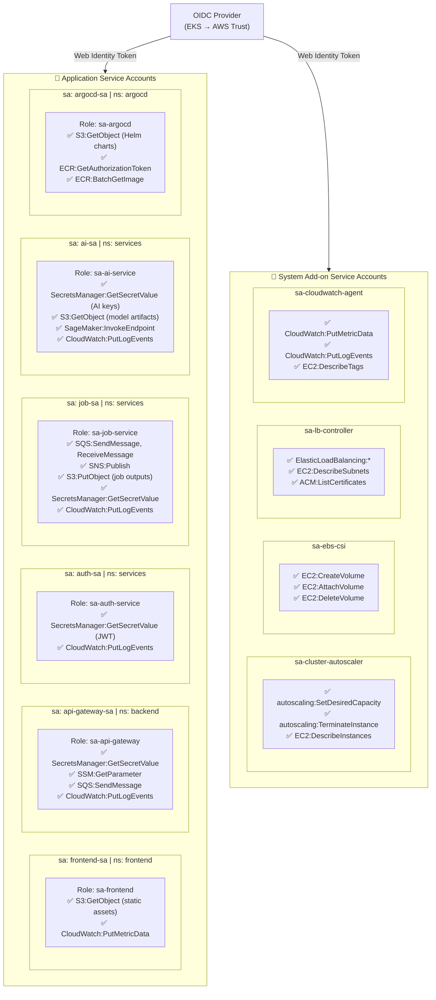

# 20 — IRSA: Service Account Roles trong EKS

> Mỗi pod chỉ có quyền đúng với service của nó — không dùng node-level IAM role

```mermaid
graph TB

    subgraph APP_SA["🔵 Application Service Accounts"]

        subgraph SA1["sa: frontend-sa  |  ns: frontend"]
            R1["Role: sa-frontend\n✅ S3:GetObject (static assets)\n✅ CloudWatch:PutMetricData"]
        end

        subgraph SA2["sa: api-gateway-sa  |  ns: backend"]
            R2["Role: sa-api-gateway\n✅ SecretsManager:GetSecretValue\n✅ SSM:GetParameter\n✅ SQS:SendMessage\n✅ CloudWatch:PutLogEvents"]
        end

        subgraph SA3["sa: auth-sa  |  ns: services"]
            R3["Role: sa-auth-service\n✅ SecretsManager:GetSecretValue (JWT)\n✅ CloudWatch:PutLogEvents"]
        end

        subgraph SA4["sa: job-sa  |  ns: services"]
            R4["Role: sa-job-service\n✅ SQS:SendMessage, ReceiveMessage\n✅ SNS:Publish\n✅ S3:PutObject (job outputs)\n✅ SecretsManager:GetSecretValue\n✅ CloudWatch:PutLogEvents"]
        end

        subgraph SA5["sa: ai-sa  |  ns: services"]
            R5["Role: sa-ai-service\n✅ SecretsManager:GetSecretValue (AI keys)\n✅ S3:GetObject (model artifacts)\n✅ SageMaker:InvokeEndpoint\n✅ CloudWatch:PutLogEvents"]
        end

        subgraph SA6["sa: argocd-sa  |  ns: argocd"]
            R6["Role: sa-argocd\n✅ S3:GetObject (Helm charts)\n✅ ECR:GetAuthorizationToken\n✅ ECR:BatchGetImage"]
        end
    end

    subgraph SYS_SA["🔧 System Add-on Service Accounts"]

        subgraph SA7["sa-cluster-autoscaler"]
            R7["✅ autoscaling:SetDesiredCapacity\n✅ autoscaling:TerminateInstance\n✅ EC2:DescribeInstances"]
        end

        subgraph SA8["sa-ebs-csi"]
            R8["✅ EC2:CreateVolume\n✅ EC2:AttachVolume\n✅ EC2:DeleteVolume"]
        end

        subgraph SA9["sa-lb-controller"]
            R9["✅ ElasticLoadBalancing:*\n✅ EC2:DescribeSubnets\n✅ ACM:ListCertificates"]
        end

        subgraph SA10["sa-cloudwatch-agent"]
            R10["✅ CloudWatch:PutMetricData\n✅ CloudWatch:PutLogEvents\n✅ EC2:DescribeTags"]
        end
    end

    OIDC["OIDC Provider\n(EKS → AWS Trust)"] -->|"Web Identity Token"| APP_SA & SYS_SA
```
