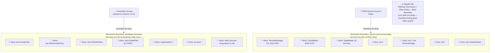

# 21 — Permission Boundaries

> Ngăn privilege escalation: dù có policy Allow, vẫn bị chặn nếu vượt boundary

```mermaid
graph TB

    subgraph PB1["Permission Boundary: developer-boundary\n(áp dụng cho tất cả developer IAM users)"]
        direction TB
        B1A["🚫 Deny: iam:CreateUser"]
        B1B["🚫 Deny: iam:AttachUserPolicy"]
        B1C["🚫 Deny: iam:PutRolePolicy"]
        B1D["🚫 Deny: iam:CreateRole (trừ IRSA)"]
        B1E["🚫 Deny: organizations:*"]
        B1F["🚫 Deny: account:*"]
        B1G["✅ Allow: AWS services trong phạm vi role"]
    end

    subgraph PB2["Permission Boundary: service-account-boundary\n(áp dụng cho tất cả IRSA roles)"]
        direction TB
        B2A["✅ Allow: SecretsManager, S3, SQS, SNS"]
        B2B["✅ Allow: CloudWatch, SSM, ECR"]
        B2C["✅ Allow: SageMaker (AI SA only)"]
        B2D["🚫 Deny: iam:*"]
        B2E["🚫 Deny: ec2:* (trừ DescribeTags)"]
        B2F["🚫 Deny: rds:*"]
        B2G["🚫 Deny: eks:CreateCluster"]
    end

    DEV_GROUPS["👥 Developer Groups\n(backend, frontend, ai-ml)"] -->|"boundary áp dụng"| PB1
    IRSA_ROLES["🤖 IRSA Service Account Roles"] -->|"boundary áp dụng"| PB2

    NOTE["⚠️ Nguyên tắc:\nEffective Permission = Allow Policy ∩ Allow Boundary\n(cả 2 phải cho phép — boundary không grant thêm quyền)"]
```
