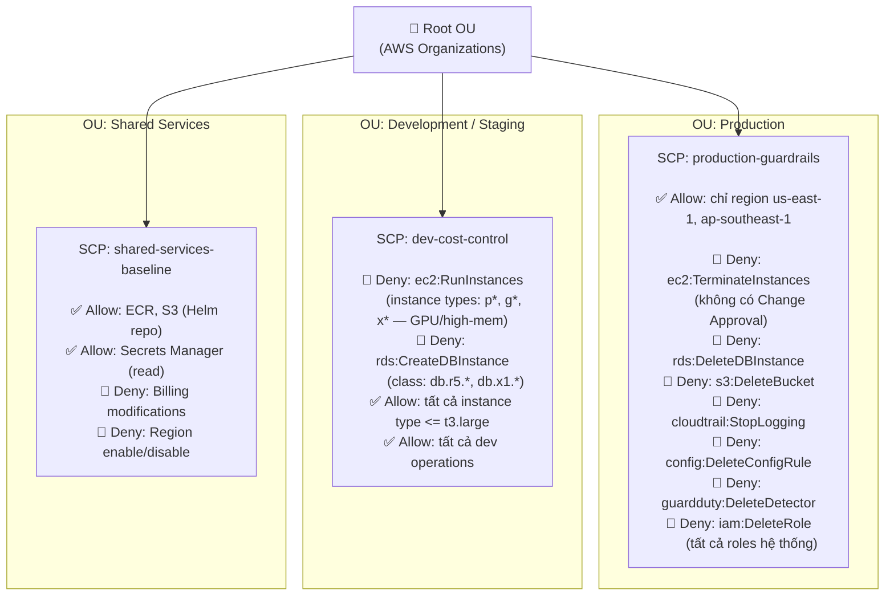

# 22 — SCP: Service Control Policies (Organization Level)

> Guardrails ở cấp AWS Organization — không ai (kể cả admin) vượt qua được

```mermaid
graph TB

    ROOT_OU["🏢 Root OU\n(AWS Organizations)"]

    subgraph PROD_OU["OU: Production"]
        SCP_PROD["SCP: production-guardrails\n\n✅ Allow: chỉ region us-east-1, ap-southeast-1\n\n🚫 Deny: ec2:TerminateInstances\n       (không có Change Approval)\n🚫 Deny: rds:DeleteDBInstance\n🚫 Deny: s3:DeleteBucket\n🚫 Deny: cloudtrail:StopLogging\n🚫 Deny: config:DeleteConfigRule\n🚫 Deny: guardduty:DeleteDetector\n🚫 Deny: iam:DeleteRole\n       (tất cả roles hệ thống)"]
    end

    subgraph DEV_OU["OU: Development / Staging"]
        SCP_DEV["SCP: dev-cost-control\n\n🚫 Deny: ec2:RunInstances\n       (instance types: p*, g*, x* — GPU/high-mem)\n🚫 Deny: rds:CreateDBInstance\n       (class: db.r5.*, db.x1.*)\n✅ Allow: tất cả instance type <= t3.large\n✅ Allow: tất cả dev operations"]
    end

    subgraph SHARED_OU["OU: Shared Services"]
        SCP_SHARED["SCP: shared-services-baseline\n\n✅ Allow: ECR, S3 (Helm repo)\n✅ Allow: Secrets Manager (read)\n🚫 Deny: Billing modifications\n🚫 Deny: Region enable/disable"]
    end

    ROOT_OU --> SCP_PROD
    ROOT_OU --> SCP_DEV
    ROOT_OU --> SCP_SHARED
```
