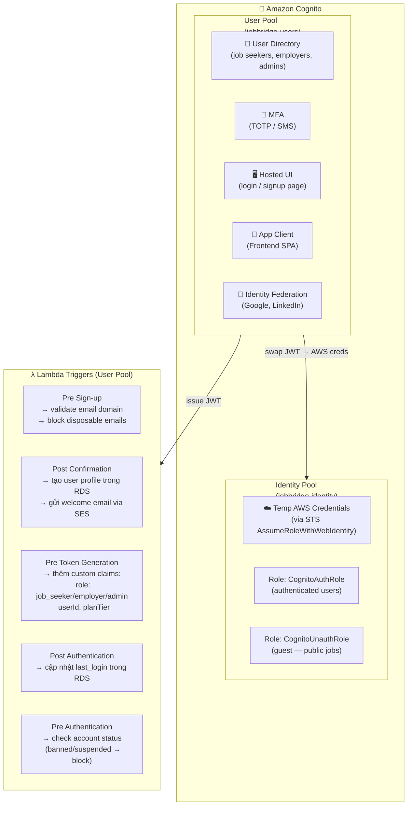
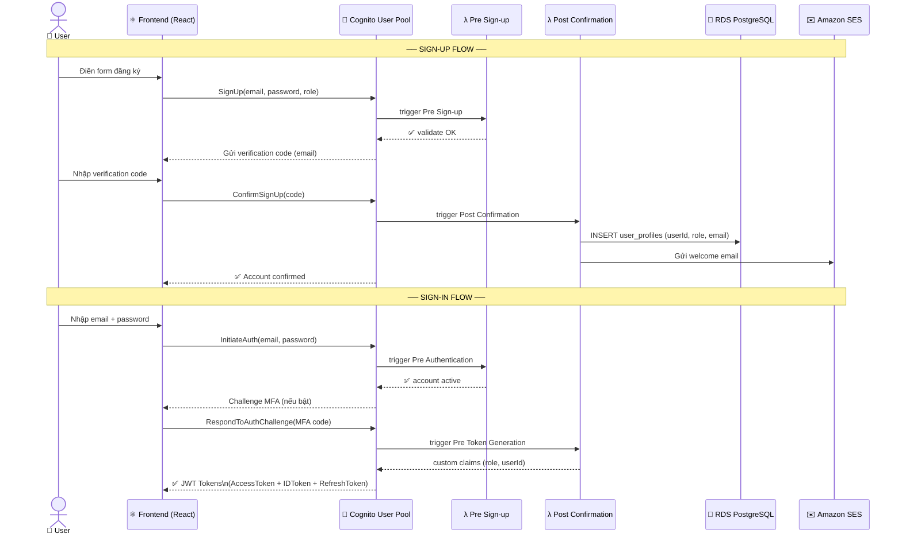
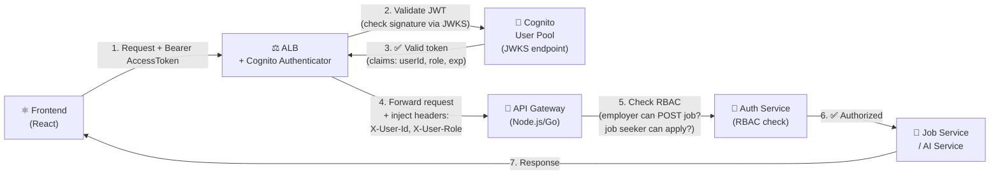
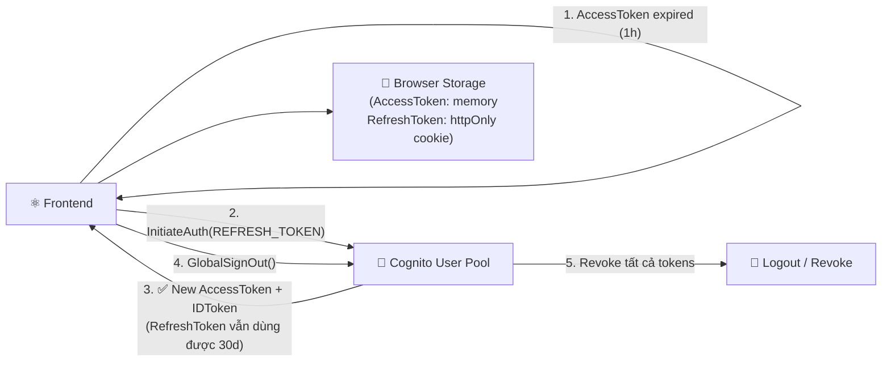
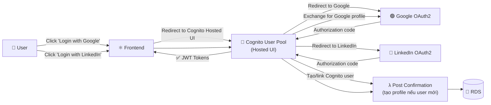

# 23 — Amazon Cognito Authentication

> Toàn bộ luồng xác thực: Sign-up, Sign-in, JWT flow, Lambda triggers, RBAC

---

## 23a — Cognito Components Overview

---

## 23b — Sign-up & Sign-in Flow

---

## 23c — API Call với JWT (Token Validation Flow)

---

## 23d — Token Refresh Flow

---

## 23e — Social Login (Google / LinkedIn)

