# IAM Roles & Permissions theo Phòng ban — JobBridge AI

> Nguyên tắc: **Least Privilege** — mỗi thực thể chỉ có quyền tối thiểu cần thiết

---

## Tổng quan các phòng ban

| Phòng ban | Trách nhiệm chính | Môi trường |
|---|---|---|
| **DevOps / Platform** | Quản lý hạ tầng, EKS, CI/CD, monitoring | Dev + Staging + Prod |
| **Backend Team** | API Gateway, Auth, Job, AI services | Dev + Staging |
| **Frontend Team** | React/Nginx frontend | Dev + Staging |
| **Data / DB Team** | RDS, migrations, backup | Dev + Staging + Prod (read) |
| **Security Team** | WAF, Secrets, Compliance, Audit | All (read-only + WAF) |
| **AI/ML Team** | AI Service, model deployment | Dev + Staging |
| **Management** | Billing, cost reports | Billing only |

---

## Mermaid — Phân cấp IAM tổng quan

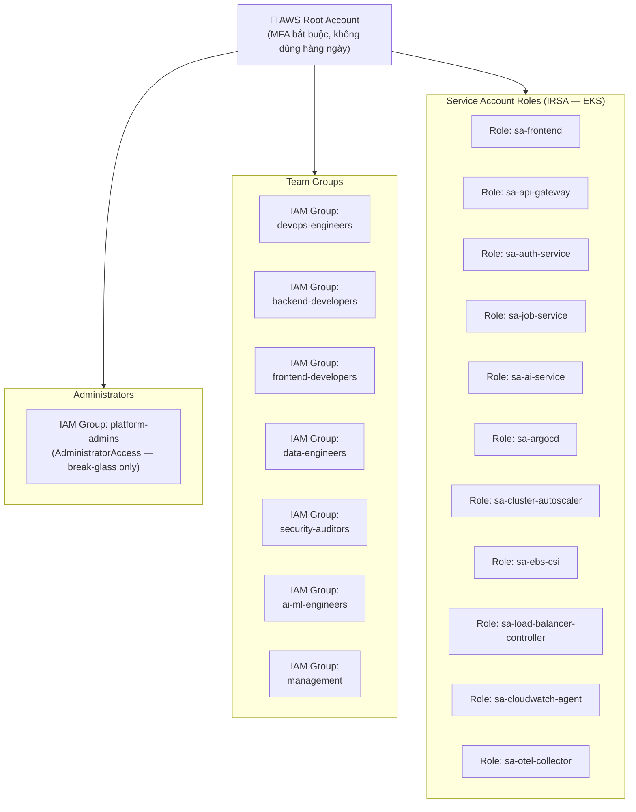

---

## Mermaid — DevOps / Platform Team

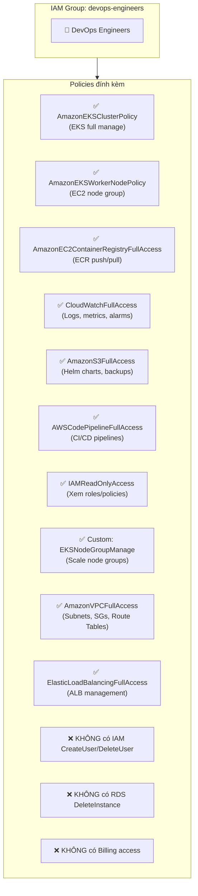

---

## Mermaid — Backend Team

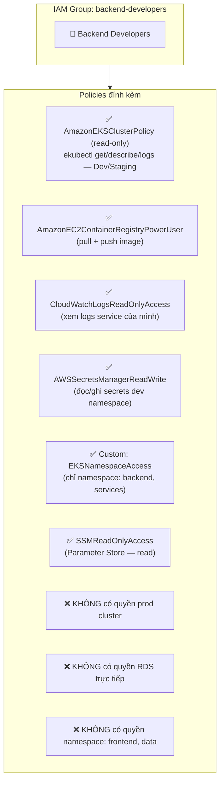

---

## Mermaid — Frontend Team

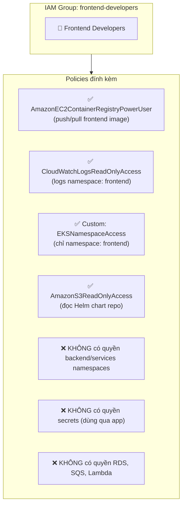

---

## Mermaid — Data / DB Team

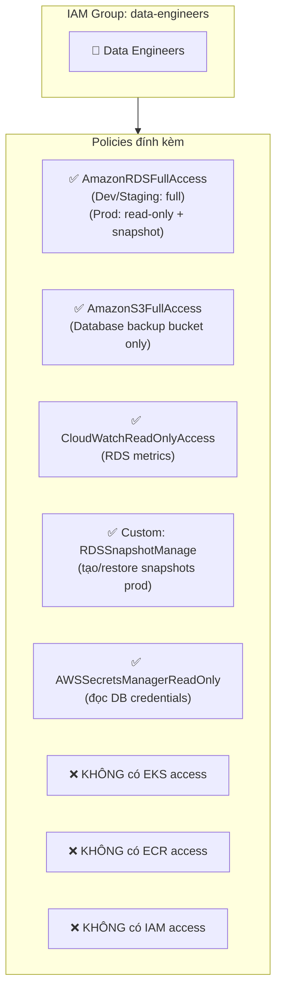

---

## Mermaid — Security Team

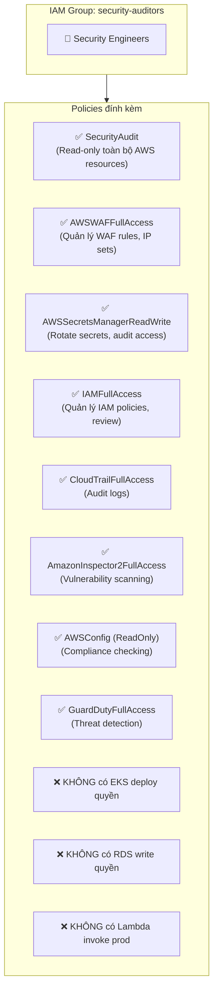

---

## Mermaid — AI/ML Team

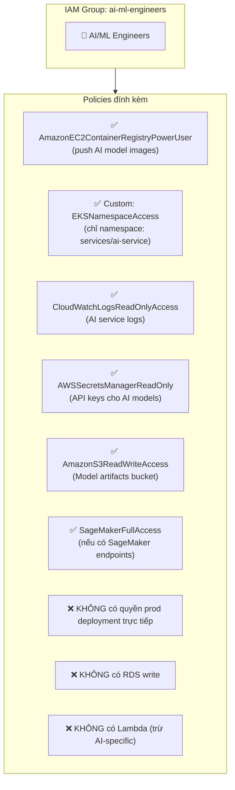

---

## Mermaid — Management

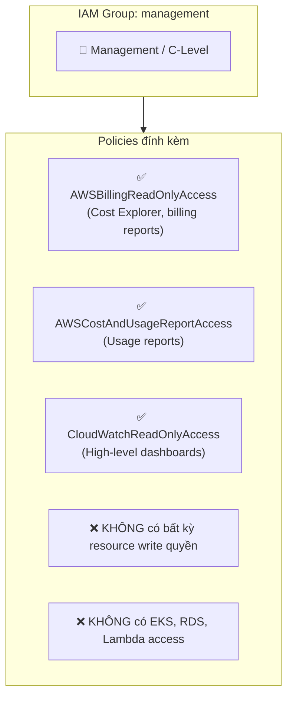

---

## Mermaid — IRSA (Service Account Roles trong EKS)

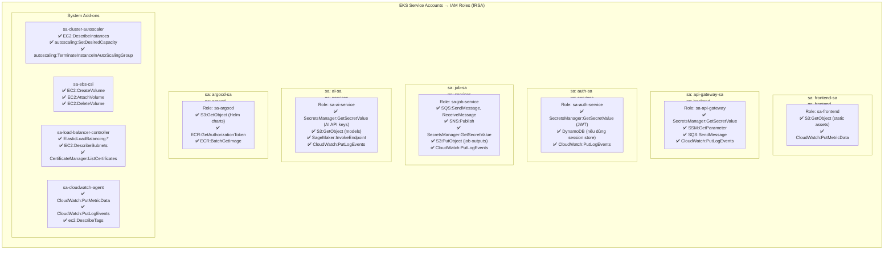

---

## Mermaid — Permission Boundaries

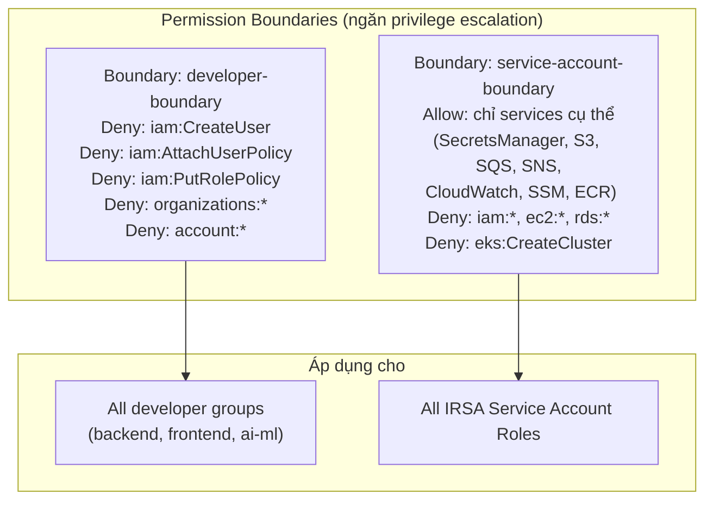

---

## Mermaid — SCP (Service Control Policies) — Organization Level

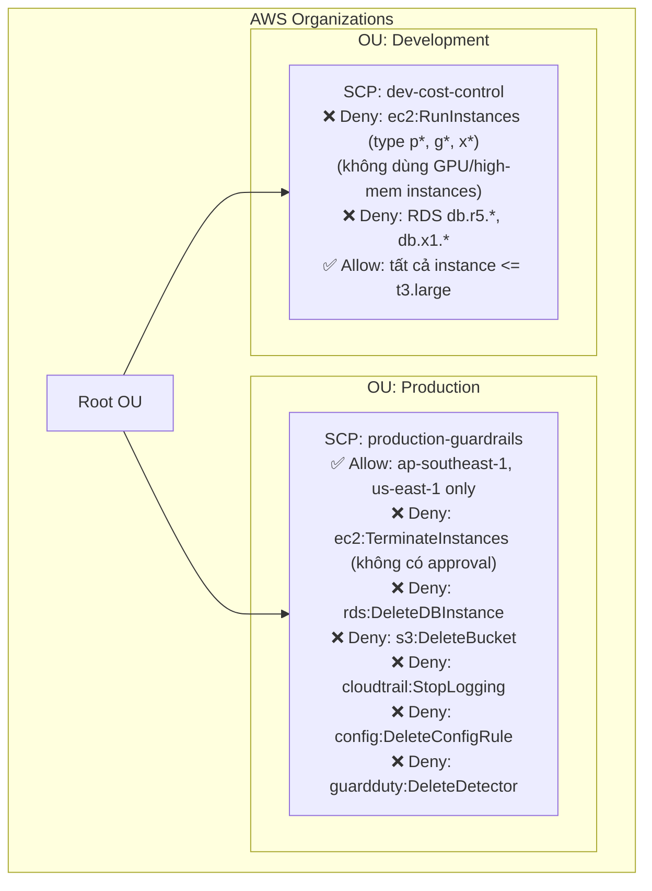

---

## Ma trận quyền hạn tổng hợp

| Service / Action | DevOps | Backend | Frontend | Data | Security | AI/ML | Management |
|---|:---:|:---:|:---:|:---:|:---:|:---:|:---:|
| EKS — full cluster | ✅ | ❌ | ❌ | ❌ | 👁️ | ❌ | ❌ |
| EKS — namespace backend | ✅ | ✅ | ❌ | ❌ | 👁️ | ❌ | ❌ |
| EKS — namespace frontend | ✅ | ❌ | ✅ | ❌ | 👁️ | ❌ | ❌ |
| EKS — namespace services | ✅ | ✅ | ❌ | ❌ | 👁️ | ✅ AI only | ❌ |
| ECR — push | ✅ | ✅ | ✅ | ❌ | ❌ | ✅ | ❌ |
| RDS — read | ✅ | ❌ | ❌ | ✅ | 👁️ | ❌ | ❌ |
| RDS — write/manage | ✅ Dev | ❌ | ❌ | ✅ Dev | ❌ | ❌ | ❌ |
| Secrets Manager | ✅ | ✅ Dev | ❌ | 👁️ | ✅ | 👁️ | ❌ |
| CloudWatch Logs | ✅ | ✅ own | ✅ own | ✅ own | ✅ | ✅ own | 👁️ |
| WAF | ✅ | ❌ | ❌ | ❌ | ✅ | ❌ | ❌ |
| IAM | ✅ read | ❌ | ❌ | ❌ | ✅ | ❌ | ❌ |
| Billing | ❌ | ❌ | ❌ | ❌ | ❌ | ❌ | ✅ read |
| S3 — Helm charts | ✅ | 👁️ | 👁️ | ❌ | 👁️ | ❌ | ❌ |
| SQS / SNS | ✅ | ✅ send | ❌ | ❌ | 👁️ | ✅ | ❌ |
| Lambda | ✅ | ❌ | ❌ | ❌ | 👁️ | ✅ AI | ❌ |

> **Chú thích:** ✅ = Full access | 👁️ = Read-only | ❌ = Không có quyền | Dev = chỉ môi trường Dev/Staging

---

## Lưu ý bảo mật

| # | Best Practice | Trạng thái |
|---|---|---|
| 1 | MFA bắt buộc cho tất cả IAM users | Bắt buộc enforce |
| 2 | Access Key rotation 90 ngày | Enforce qua IAM Policy |
| 3 | Không dùng root account hàng ngày | Root chỉ dùng break-glass |
| 4 | CloudTrail bật toàn region | Ghi log tất cả API calls |
| 5 | AWS Config rules — kiểm tra compliance | Enable SecurityHub |
| 6 | GuardDuty — threat detection | Enable tất cả accounts |
| 7 | Permission Boundary cho tất cả developers | Tránh privilege escalation |
| 8 | IRSA thay vì node-level IAM role | Least privilege per pod |
| 9 | SCP ở Organization level | Ngăn destructive actions trên prod |
| 10 | Secrets Manager — auto rotation 30 ngày | Không hardcode credentials |
