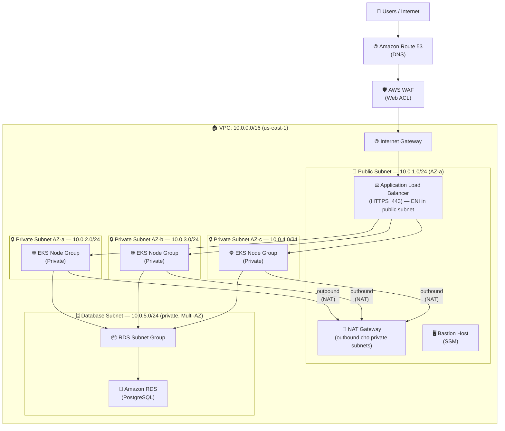
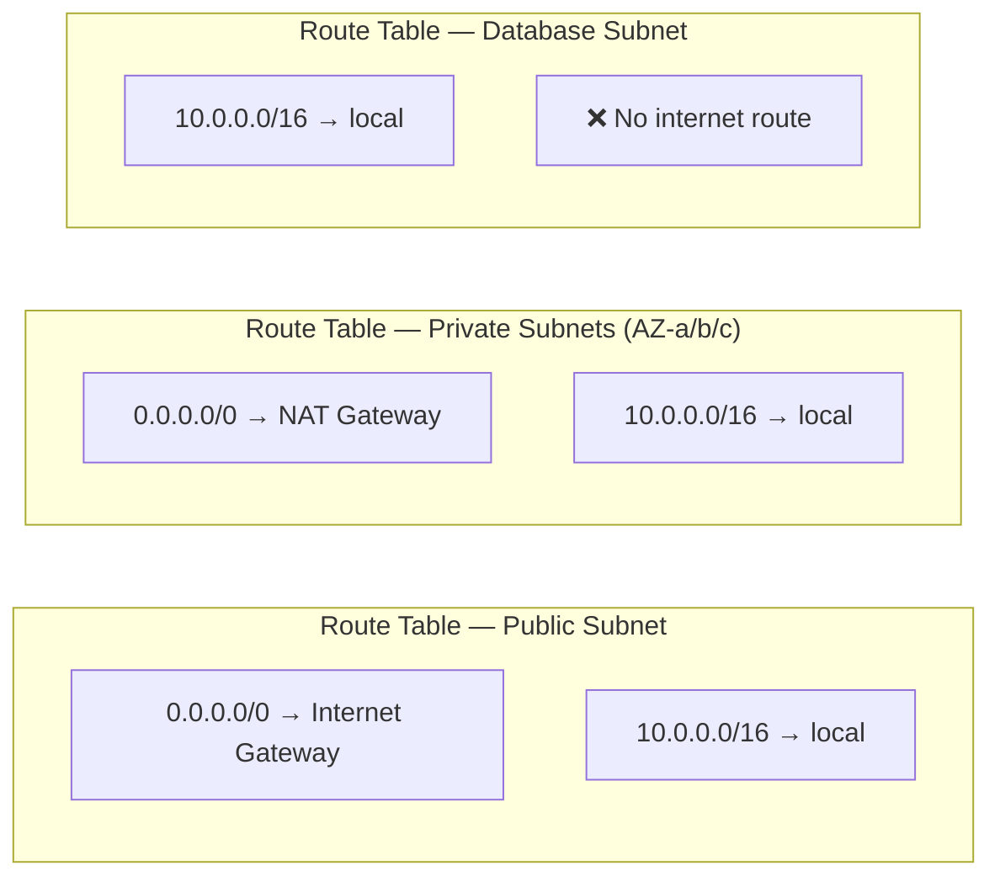
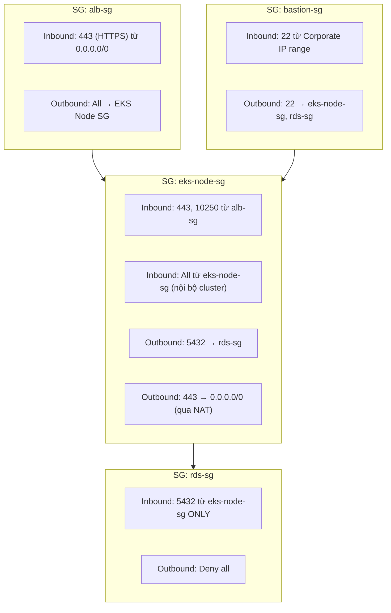
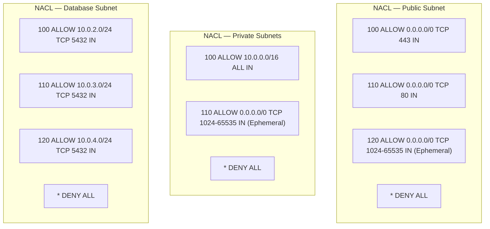
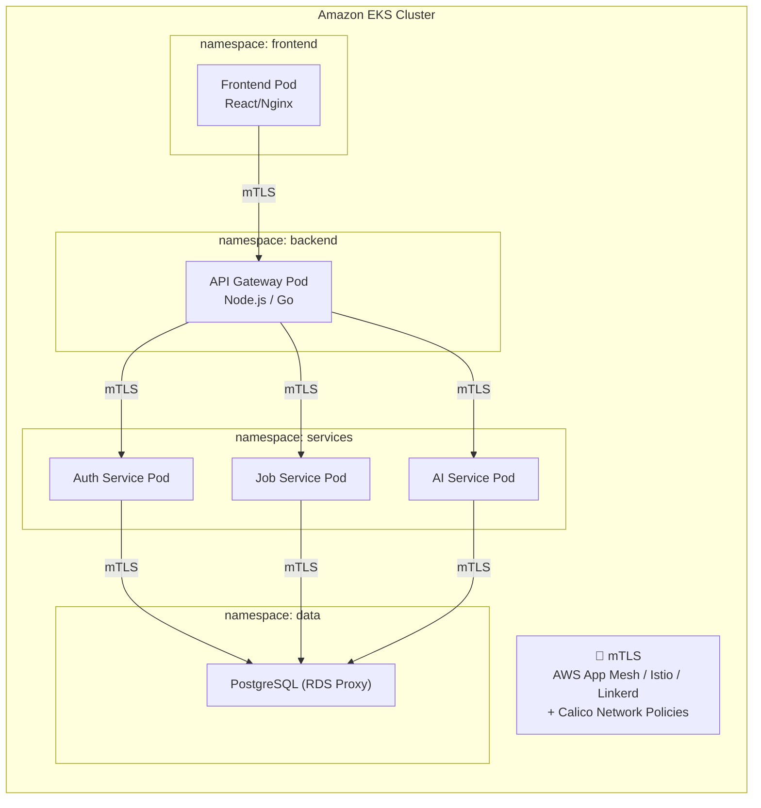

# Network Architecture — JobBridge AI

> Region: **us-east-1** | VPC CIDR: **10.0.0.0/16**

---

## Subnet Layout

| Subnet | CIDR | AZ | Loại | Thành phần |
|---|---|---|---|---|
| Public Subnet | 10.0.1.0/24 | AZ-a | Public | NAT Gateway, Bastion Host (SSM) |
| Private Subnet AZ-a | 10.0.2.0/24 | AZ-a | Private | EKS Node Group |
| Private Subnet AZ-b | 10.0.3.0/24 | AZ-b | Private | EKS Node Group |
| Private Subnet AZ-c | 10.0.4.0/24 | AZ-c | Private | EKS Node Group |
| Database Subnet | 10.0.5.0/24 | Multi-AZ | Private | RDS Subnet Group (PostgreSQL) |

---

## Mermaid — Network Topology

---

## Mermaid — Routing Tables

---

## Mermaid — Security Groups

---

## Mermaid — Network Access Control (NACLs)

---

## Mermaid — Internal Traffic (mTLS + Network Policies)

---

## Lưu ý kiến trúc (Known Issues)

| # | Vấn đề tiềm ẩn | Đề xuất sửa |
|---|---|---|
| 1 | Database Subnet chỉ có 1 AZ (10.0.5.0/24) | Thêm 10.0.6.0/24 (AZ-b), 10.0.7.0/24 (AZ-c) cho Multi-AZ RDS |
| 2 | Bastion Host exposed qua SSH | Dùng SSM Session Manager thay thế, remove SG port 22 |
| 3 | Single NAT Gateway (điểm lỗi duy nhất) | Thêm NAT Gateway mỗi AZ để HA |
| 4 | ALB không có WAF rule rõ ràng | Định nghĩa cụ thể AWS Managed Rules + rate limiting |
